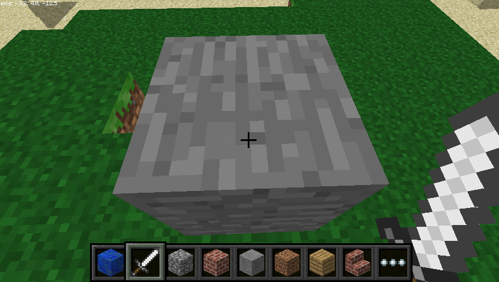
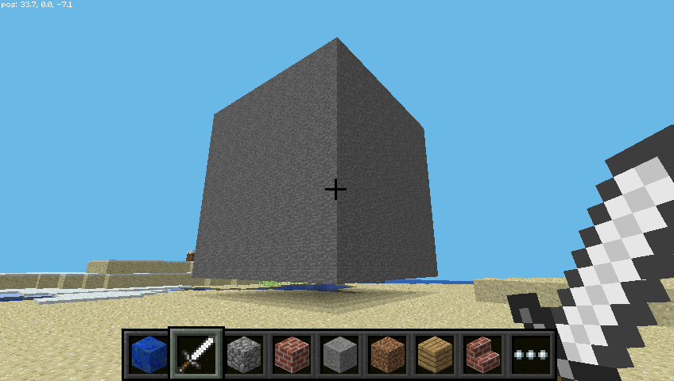

## استخدم الواجهة البرمجية لبايثون

بماينكرافت مشغلة, و العام مخلوق, خذ تركيزك خارج اللعبة بالضغط على زر `تبويب`, الذي سيحرر فأرتك. افتح بايثون 3 Python من قائمة التطبيقات و حرك النوافذ لتكون جنبا لجنب.

يمكنك إما إدخال الأوامر مباشرة في نافذة البايثون Python أو خلق ملف بحيث يمكنك حفظ كودك و تنفيذه مجدداً لاحقاً.

إذا أردت خلق ملف. اذهب إلى`ملف> نافذة جديدة` و`ملف> حفظ`. من المحتمل ستريد حفظ هذا في مجلدك الأم أو في مجلد مشروع جديد.

ابدأ باستيراد مكتبة الماينكرافت, خالقا اتصالا باللعبة و مجراباً له بعرض الرسالة التالية "مرحباً عالم" على الشاشة:

```python
من mcpi.minecraft استورد ماينكرافت

mc = Minecraft.create()

mc.postToChat("مرحبا عالم")
```

إذا كنت تدخل الأوامر مباشرةً على نافذة البايثون Python, اضغط على زر `أدخل` بعد كل سطر. إذا كان ملفاً, احفظ بالضغط على `Ctrl + S` و نفذ بالضغط على `F5`. عندما يشتغل كودك, يفترض أن ترى رسالتك على الشاشة في اللعبة.


### جد موقعك

لتجد موقعك, أدخل:

```python
pos = mc.player.getPos()
```

`pos` الآن يحتوي موقعك, أدخل إلى كل جزء من تشكيلة الإحداثيات مع `pos.x`,`pos.y` و `pos.z`.

بدلاً, هناك طريقة للحصول على الإحداثيات في متغيرات منفصلة و هي باستعمال تقنيات تفريغ بايثون Python:

```python
x, y, z = mc.player.getPos()
```

الآن `x`,`y`, و `z` تحتوي على كل جزء من إحداثيات موقعك. `x` و`z` تمثل اتجاهات المشي (الأمام/الخلف و اليسار/اليمين) و `y` تمثل الأعلى/ الأسفل.

انتبه أن `getPos()` ترجع إحداثيات اللاعب في ذلك الوقت, و إذا تحركت مكانك يتوجب عليك استدعاء الدالة مجددا أو استعمل الموقع المخزن.

### الإنتقال البعدي

مثل إيجادك لإحداثياتك الحالية تستطيع تخصيص موقع معين لتنتقل بعديا إليه.

```python
x, y, z = mc.player.getPos()
mc.player.setPos(x, y+100, z)
```

هذا سينقل لاعبك إلى 100 فراغ في الهواء. هذا سيعني إنتقالك بعديا إلى وسط السماء و سقوطك حالها أرضا إلى حيثما كنت.

جرب الإنتقال البعدي إلى مكان آخر ما!

### شكل كتلة

يمكنك وضع كتلة واحدة في تشكيلة إحداثيات معطاة ب `mc.setBlock()`:

```python
x, y, z = mc.player.getPos()
mc.setBlock(x+1, y, z, 1)
```

الآن, يفترض أن تظهر كتلة حجر بجانب موقفك. إن لم تكن حالا أمامك فربما بجانبك أو خلفك. ارجع لنافذة الماينكرافت و استعمل الفأرة لتدور حولك حتى ترى كلتة رمادية أمامك مباشرة.



العمدات الممرة إلى `مجموعة كتلة` هي `x`,`y`,`z` و `id`. ال `(x, y, z)` تشير إلى موقعك في العالم (خصصنا كتلة بعيدا من أين يقف اللاعب ب `x + 1`) و ال `id` تشير إلى طبيعة الكتلة المراد وضعها. `1` هي حجر.

كتل أخرى يمكنك تجربتها:

    الهواء: 0
    العشب: 2
    التراب: 3
    

الآن, مع الكتلة في نظرك, حاول تغييرها لشيء آخر ما:

```python
mc.setBlock(x+1, y, z, 2)
```

يفترض رؤيتك لكتلة حجر رمادي تتغير أمام عينيك!


#### ثوابت الكتلة

يمكنك استعمال كتل ثابتة كامنة لتشكل كتلك, إذا تعرف أسماءها. ستحتاج `استيراد` سطر أول آخر, رغماً.

```python
من mcpi استورد كتلة
```

الآن يمكنك كتابة التالي لوضع كتلة:

```python
mc.setBlock(x+3, y, z, block.STONE.id)
```

وثائق تعريف الكتل جد سهلة التخمين, فقط استعمل ALL CAPS, لكن هناك توجد أمثلة قليلة لتعودك طريقة تسميتها.

    WOOD_PLANKS
    WATER_STATIONARY
    GOLD_ORE
    GOLD_BLOCK
    DIAMOND_BLOCK
    NETHER_REACTOR_CORE
    

### الكتلة كمتغير

إذا تعرف وثيقة تعريف كتلة, يمكن تكون صالحة لوضعها كمتغير. يمكنك استعمال الاسم أو رقم وثيقة التعريف الصحيح.

```python
dirt = 3
mc.setBlock(x, y, z, dirt)
```

أو

```python
dirt = block.DIRT.id
mc.setBlock(x, y, z, dirt)
```

### كتل خاصة

هناك بعض الكتل التي تملك خصائص فائقة,كالصوف الذي له إعداد فائق, يمكنك تحديد اللون. لوضع هذا استعمل الخيار الرابع في `setBlock`:

```python
wool = 35
mc.setBlock(x, y, z, wool, 1)
```

هنا الخيار الرابع`1` يضع لون الصوف في البرتقالي. بدون الخيار الرابع يوضع بالأصل (`0`) أي أبيض. بعض الألوان الأخرى:

    2: الآجوري
    3: السماوي
    4: الأصفر
    

جرب أرقاماً أخرى و شاهد الكتلة تتغير!

الكتل الأخرى التي تمتلك إعدادات فائقة هي الخشب (`17`): البلوط, التنّوب, التامول, إلخ, العشب الطويل (`31`): شجيرة, العشب, السرخس, المشعل (`50`): تأشير شرق, غرب, شمال, جنوب, و أكثر. أنظر [مرجع واجة التطبيق البرمجية](http://www.stuffaboutcode.com/p/minecraft-api-reference.html) لكامل التفاصيل.

### ضع عدة كتل

كوضع كتلة واحدة ب`setBlock` يمكنك ملء حجم من الفضاء على مرة ب`setBlocks`:

```python
stone = 1
x, y, z = mc.player.getPos()
mc.setBlocks(x+1, y+1, z+1, x+11, y+11, z+11, stone)
```

هذا سيملأ في 10x 10 x 10 مكعب من الحجر الصلب.



يمكنك خلق أحجام أكبر بدالة ال`setBlocks` لكن ربما تأخذ أطول لتتولد!