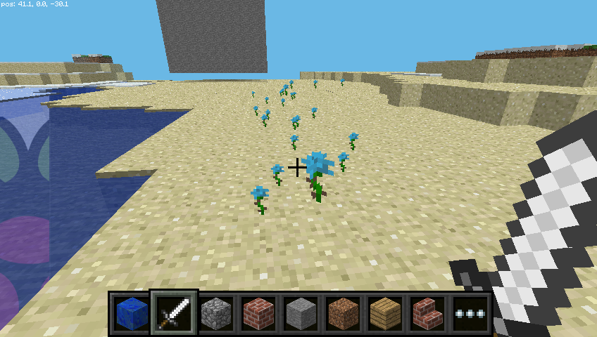
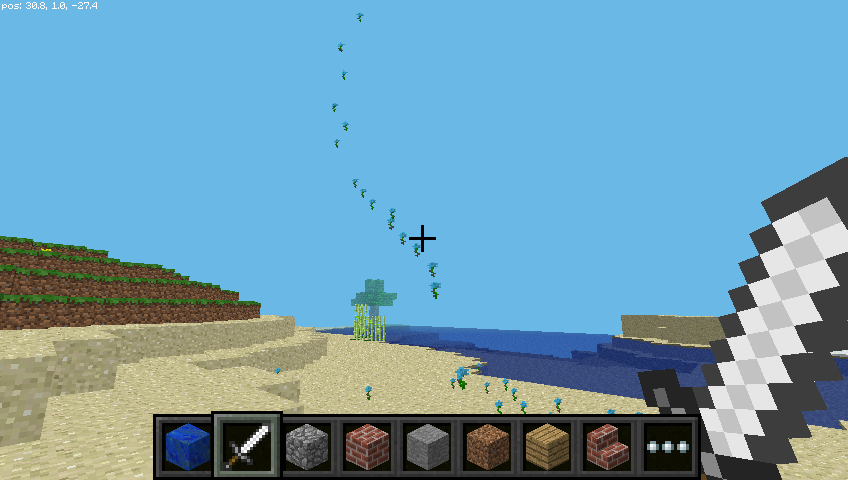
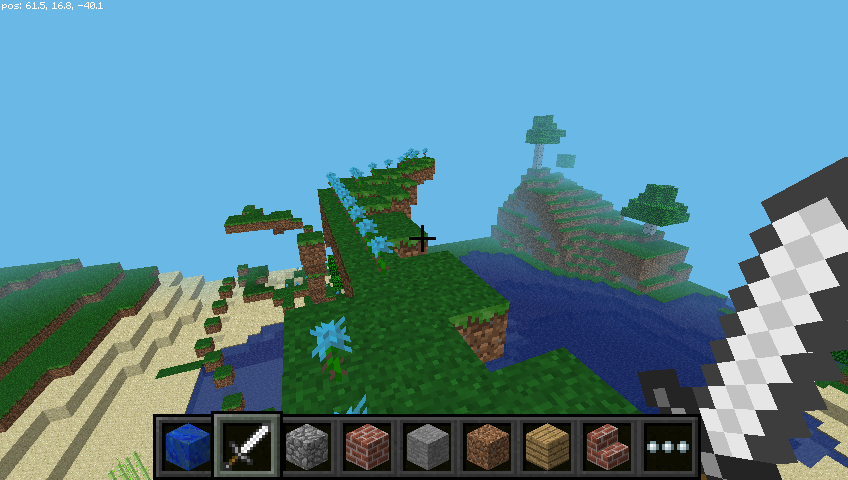

## إسقاط الكتل عند المشي

الآن تعرف كيف تسقط الكتل ، فلنستخدم موقعنا المتحرك لإسقاط الكتل عند مشيك.

الكود التالي سيسقط زهرة خلفك أينما مشيت:

```python
من mcpi.minecraft استورد Minecraft
من time استورد sleep

mc = Minecraft.create()

 flower= 38

while True:
    x, y, z = mc.player.getPos()
    mc.setBlock(x, y, z, flower)
    sleep(0.1)
```

الآن تقدم للأمام لبرهة و استدر لرؤية زهور تركتها خلفك.



نظرا لاستعمالنا لحلقة `while True` هذا سيعمل للأبد. لإيقافه، في نافذة بايثون Python اضغط على `Ctrl + C`.

جرب الطيران في الهواء وشاهد زهورا تتركها في السماء:



ماذا لو أردنا إسقاط الزهور فقط عند مشي اللاعب على العشب؟ يمكننا استخدام `getBlock` لمعرفة نوع الكتلة:

```python
x, y, z = mc.player.getPos()  # player position (x, y, z)
this_block = mc.getBlock(x, y, z)  # block ID
print(this_block)
```

يخبرك هذا بموقع الكتلة التي تقف *فيها* (سيكون هذا `0` - كتلة هوائية). نريد أن نعرف نوع الكتلة التي نقف *عليها*. لهذا نطرح 1 من قيمة `y` ونستخدم `getBlock ()` لتحديد نوع الكتلة الواقفين عليها:

```python
x, y, z = mc.player.getPos()  # player position (x, y, z)
block_beneath = mc.getBlock(x, y-1, z)  # block ID
print(block_beneath)
```

يخبرنا هذا بمعرف الكتلة الواقف عليها اللاعب.

اختبر هذا بتشغيل حلقة لطباعة معرف الكتلة لكل ما تقف عليه حاليًا:

```python
while True:
    x, y, z = mc.player.getPos()
    block_beneath = mc.getBlock(x, y-1, z)
    print(block_beneath)
```


يمكننا استخدام عبارة `if` لاختيار ما إذا كنا نزرع زهرة أم لا:

```python
grass = 2
flower = 38

while True:
    x, y, z = mc.player.getPos()  # player position (x, y, z)
    block_beneath = mc.getBlock(x, y-1, z)  # block ID

    if block_beneath == grass:
        mc.setBlock(x, y, z, flower)
    sleep(0.1)
```

ربما يمكننا بعد ذلك تحويل البلاط الذي نقف عليه إلى عشب إذا لم يكن عشبًا أصلاً:

```python
if block_beneath == grass:
    mc.setBlock(x, y, z, flower)
else:
    mc.setBlock(x, y-1, z, grass)
```

الآن يمكننا المشي للأمام وإذا مشينا على عشب ، سنترك زهرة خلفنا. إذا لم تكن الكتلة التالية عشباً ، ستتحول لعشب. عندما نستدير ونعود ، نترك الآن زهرة خلفنا.

