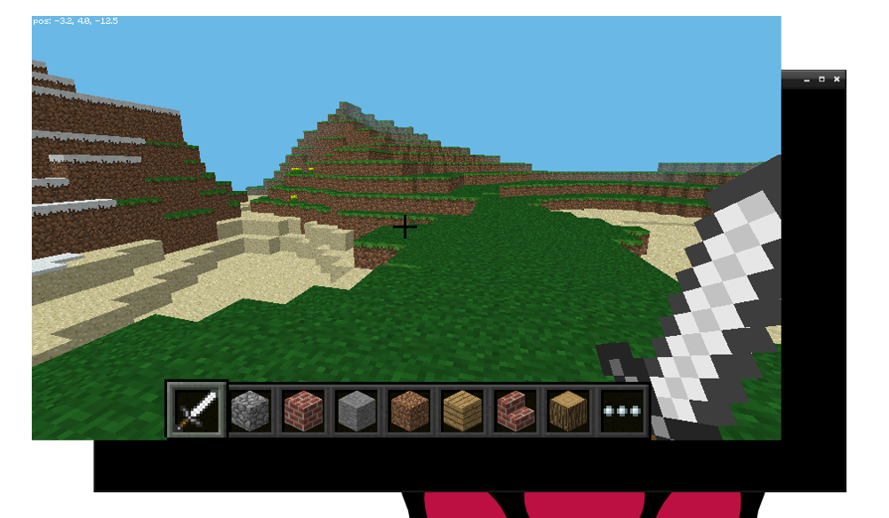
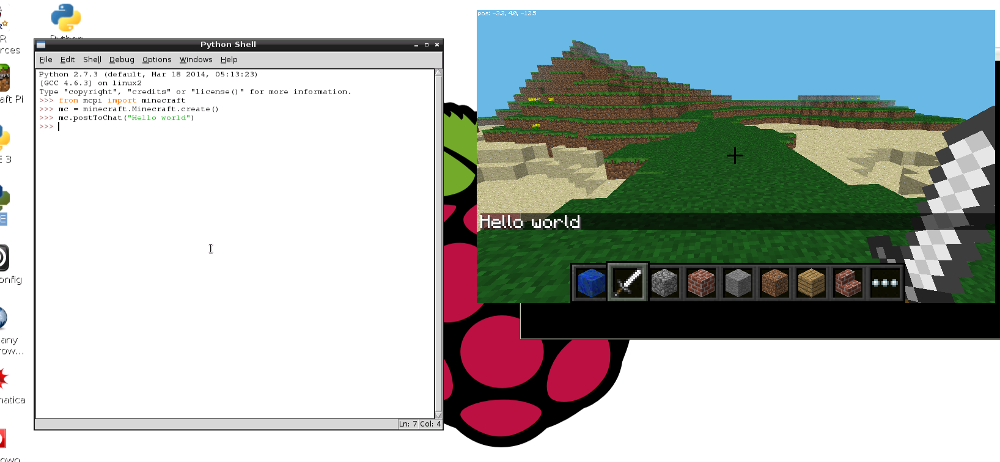

## Was du brauchen wirst

### Software

#### Softwareinstallation

Minecraft ist seit September 2014 standardmäßig in Raspbian installiert.


Wenn du eine ältere Version von Raspbian verwendest, öffne ein Terminalfenster und gebe die folgenden Befehle ein (du musst hierfür online sein):

```bash
sudo apt-get update
sudo apt-get install minecraft-pi
```

Sobald dies abgeschlossen ist, sollten Minecraft Pi und die Python-Bibliothek installiert sein.

#### Minecraft testen

Um Minecraft auszuführen, doppelklicke auf das Desktop-Symbol oder gib `minecraft-pi` in das Terminal ein.


Wenn Minecraft Pi geladen wurde, klicke auf **Start Game**, danach auf **Create new**. Du wirst feststellen, dass das enthaltene Fenster leicht versetzt ist. Dies bedeutet, dass du zum Ziehen des Fensters die Titelleiste hinter dem Minecraft-Fenster greifen musst.



Du bist jetzt in einem Minecraft-Spiel!

#### Python testen

Wenn Minecraft läuft und die Welt erstellt ist, lenke deinen Fokus vom Spiel weg, indem du die Taste `Tab` drückst, wodurch der Mauszeiger frei wird. Öffne Python 3 (IDLE) auf dem Desktop und verschiebe die Fenster so, dass sie nebeneinander liegen.

Du kannst entweder Befehle direkt in das Python-Fenster eingeben oder eine Datei erstellen, um deinen Code zu speichern und ein anderes Mal erneut auszuführen.

Wenn du eine Datei erstellen möchtest, gehe zu `Datei > Neues Fenster` und `Datei > Speichern`. Du möchtest das wahrscheinlich in deinem Home-Ordner oder einem neuen Projektordner speichern.

Importiere zunächst die Minecraft-Bibliothek, stelle eine Verbindung zum Spiel her und teste sie, indem du die Meldung "Hello World" auf den Bildschirm schreibst:

```python
from mcpi import minecraft

mc = minecraft.Minecraft.create()

mc.postToChat("Hello World")
```

Wenn du Befehle direkt in das Python-Fenster eingibst, drücke einfach nach jeder Zeile `Enter`. Wenn es sich um eine Datei handelt, speichere sie mit `Strg + S` und führe sie mit `F5` aus. Wenn dein Code ausgeführt wird, sollte deine Nachricht im Spiel auf dem Bildschirm angezeigt werden.



Wenn du im Minecraft-Fenster "Hello World" siehst, kannst du mit dem nächsten Schritt fortfahren.