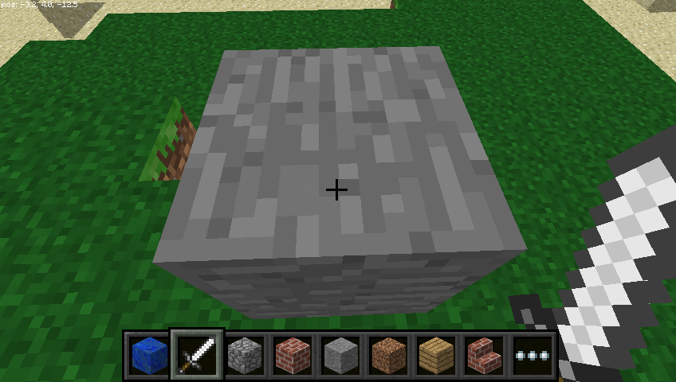
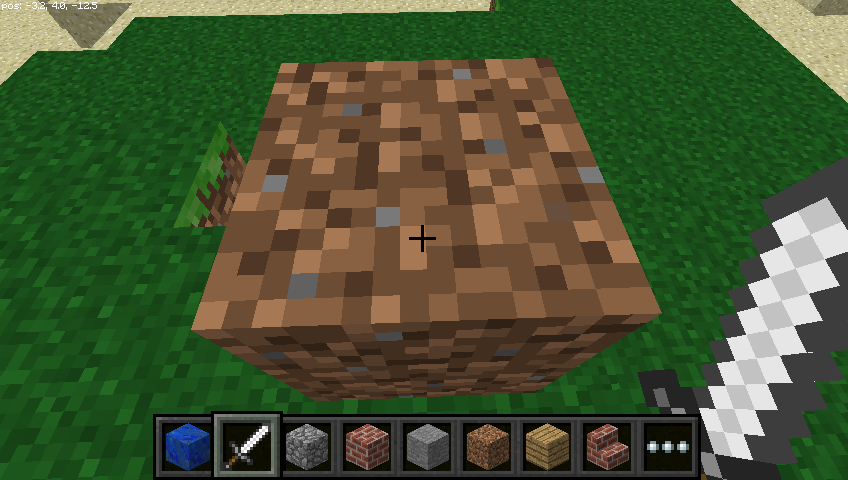
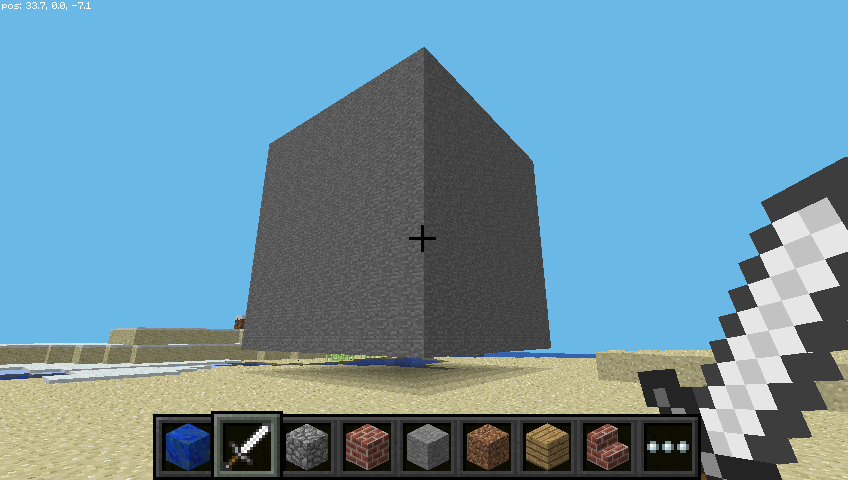

## Benutze die Programmierschnittstelle von Python

Wenn Minecraft läuft und die Welt erschaffen wurde, bringe deinen Fokus vom Spiel weg, indem du die Taste `Tab` drückst, wodurch deine Maus frei wird. Öffne Python 3 über das Anwendungsmenü und verschiebe die Fenster so, dass sie nebeneinander liegen.

Du kannst entweder Befehle direkt in das Python-Fenster eingeben oder eine Datei erstellen, um deinen Code zu speichern und ein anderes Mal erneut auszuführen.

Wenn du eine Datei erstellen möchtest, gehe zu `Datei > Neues Fenster` und `Datei > Speichern`. Du möchtest das wahrscheinlich in deinem Home-Ordner oder einem neuen Projektordner speichern.

Importiere zunächst die Minecraft-Bibliothek, stelle eine Verbindung zum Spiel her und teste sie, indem du die Meldung "Hallo Welt" auf den Bildschirm schreibst:

```python
from mcpi.minecraft import Minecraft

mc = Minecraft.create()

mc.postToChat("Hallo Welt")
```

Wenn du Befehle direkt in das Python-Fenster eingibst, drücke einfach nach jeder Zeile `Enter`. Wenn es sich um eine Datei handelt, speichere sie mit `Strg + S` und führe sie mit `F5` aus. Wenn dein Code ausgeführt wird, sollte deine Nachricht im Spiel auf dem Bildschirm angezeigt werden.


### Finde deinen Standort

Um deinen Standort herauszufinden, tippe folgendes ein:

```python
pos = mc.player.getPos()
```

`pos` enthält jetzt deinen Standort; Greife auf jeden Teil des Koordinatensatzes mit `pos.x`, `pos.y` und `pos.z` zu.

Alternativ kann man die Koordinaten in getrennte Variablen umwandeln, indem man Pythons Auspackungstechnik verwendet:

```python
x, y, z = mc.player.getPos()
```

Jetzt enthalten `x`, `y`und `z` jeden Teil deiner Positionskoordinaten. `x` und `z` sind die Laufrichtungen (vorwärts/rückwärts und links/rechts) und `y` ist oben/unten.

Beachte, dass `getPos()` den aktuellen Standort des Spielers zurückgibt. Wenn du die Position veränderst, musst du die Funktion erneut aufrufen oder den gespeicherten Standort verwenden.

### Teleportieren

Du kannst nicht nur deinen aktuellen Standort ermitteln, sondern auch eine bestimmte Stelle angeben, zu der du teleportieren möchten.

```python
x, y, z = mc.player.getPos()
mc.player.setPos(x, y+100, z)
```

Das wird deinen Spieler 100 Felder in die Luft transportieren. Das bedeutet, dass du in die Mitte des Himmels teleportiert wirst und direkt wieder dorthin zurück fällst, wo du gestartet bist.

Versuche dich an einen anderen Ort zu teleportieren!

### Block setzen

Du kannst einen einzelnen Block an einem bestimmten Koordinatensatz mit `mc.setBlock()` setzen:

```python
x, y, z = mc.player.getPos()
mc.setBlock(x+1, y, z, 1)
```

Jetzt sollte ein Steinblock neben deiner Position erscheinen. Wenn er nicht unmittelbar vor dir liegt, kann er neben oder hinter dir sein. Kehre zum Minecraft-Fenster zurück und drehe dich mit der Maus an Ort und Stelle, bis du einen grauen Block direkt vor dir siehst.



Die an `setBlock` übergebenen Argumente sind `x`, `y`, `z` und `id`. `(x, y, z)` bezieht sich auf die Position in der Welt (wir haben einen Block von der Stelle angegeben, an der der Spieler steht mit `x + 1`) und die `id` bezieht sich auf die Art des Blocks, den wir platzieren wollen. `1` ist Stein.

Andere Blöcke, die du ausprobieren kannst:

    Luft: 0
    Gras: 2
    Erde: 3
    

Versuche nun, mit dem Block im Blick, ihn in etwas anderes zu verwandeln:

```python
mc.setBlock(x+1, y, z, 2)
```

Du solltest sehen, wie sich der graue Steinblock vor deinen Augen verändert!



#### Blockkonstanten

Du kannst eine eingebaute Blockkonstante verwenden, um deine Blöcke zu setzen, wenn du deren Namen kennst. Du benötigst jedoch zuerst eine weitere `Import` Zeile.

```python
from mcpi import block
```

Jetzt kannst du Folgendes schreiben, um einen Block zu platzieren:

```python
mc.setBlock(x+3, y, z, block.STONE.id)
```

Block-IDs sind ziemlich einfach zu erraten. Verwende einfach NUR GROSSBUCHSTABEN (und die englischen Namen der Blöcke). Hier sind einige Beispiele, um dich an die Art und Weise zu gewöhnen, wie sie benannt sind.

    WOOD_PLANKS #Holzplanken
    WATER_STATIONARY #stehendes Wasser
    GOLD_ORE #Golderz
    GOLD_BLOCK #Goldblock
    DIAMOND_BLOCK #Diamandblock
    NETHER_REACTOR_CORE #Netherreaktorkern
    

### Block als Variable

Wenn du die ID eines Blocks kennst, kann es hilfreich sein, ihn als Variable festzulegen. Du kannst den Namen oder die Ganzzahl-ID verwenden.

```python
erde = 3
mc.setBlock(x, y, z, erde)
```

oder

```python
erde = block.DIRT.id
mc.setBlock(x, y, z, erde)
```

### Spezielle Blöcke

Es gibt einige Blöcke mit zusätzlichen Eigenschaften, z. B. Wolle mit einer zusätzlichen Einstellung, mit der du die Farbe festlegen kannst. Um dies einzustellen, verwende den optionalen vierten Parameter in `setBlock`:

```python
wolle = 35
mc.setBlock(x, y, z, wolle, 1)
```

Hier setzt der vierte Parameter `1` die Wollfarbe auf Orange. Ohne den vierten Parameter wird sie auf den Standardwert (`0`) gesetzt, der weiß ist. Einige weitere Farben sind:

    2: Magenta
    3: Hellblau
    4: Gelb
    

Probiere weitere Zahlen aus und beobachte wie sich der Block verändert!

Andere Blöcke mit zusätzlichen Eigenschaften sind Holz (`17`): Eiche, Fichte, Birke usw.; hohes Gras (`31`): Strauch, Gras, Farn; Fackel (`50`): zeigt nach Osten, Westen, Norden, Süden; und mehr. Ausführliche Informationen findest du in der [API-Referenz](http://www.stuffaboutcode.com/p/minecraft-api-reference.html).

### Mehrere Blöcke setzen

Genau wie du einen einzelnen Block mit `setBlock` setzen kannst, kannst du auch mit `setBlocks` ein Raumvolumen auf einmal ausfüllen:

```python
stein = 1
x, y, z = mc.player.getPos()
mc.setBlocks(x+1, y+1, z+1, x+11, y+11, z+11, stein)
```

Dadurch wird ein 10 x 10 x 10 Würfel mit massivem Stein gefüllt.



Du kannst auch größere Volumen mit der Funktion `setBlocks` erstellen, die Generierung kann jedoch länger dauern!