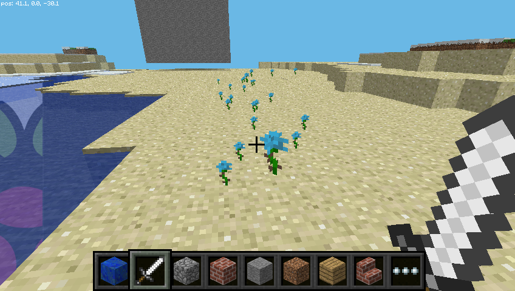
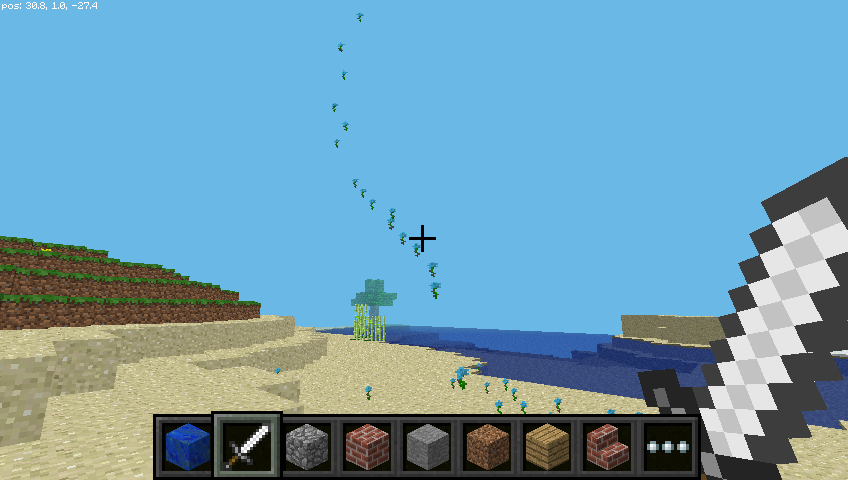

## Blöcke beim Gehen fallen lassen

Jetzt weißt du, wie man Blöcke fallen lässt. Lass uns unsere sich ändernde Position verwenden, um Blöcke fallen zu lassen, wenn du gehst.

Der folgende Code lässt eine Blume hinter dir fallen, wo immer du gehst:

```python
from mcpi.minecraft import Minecraft
from time import sleep

mc = Minecraft.create()

blume = 38

while True:
x, y, z = mc.player.getPos()
mc.setBlock(x, y, z, blume)
sleep(0.1)
```

Gehe jetzt eine Weile vorwärts und drehe dich um, um die Blumen zu sehen, die du zurückgelassen hast.



Da wir eine `while True` (also "solange Wahr") Schleife verwendet haben, wird dies für immer weitergehen. Um es zu stoppen, drücke im Python-Fenster `Strg + C`.

Versuche durch die Luft zu fliegen und sieh die Blumen, die du am Himmel hinterlässt:



Was wäre, wenn wir nur Blumen fallen lassen wollten, wenn der Spieler auf Gras läuft? Wir können `getBlock` verwenden, um herauszufinden von welchem Typ ein Block ist:

```python
x, y, z = mc.player.getPos() # Spielerposition (x, y, z)
dieser_block = mc.getBlock(x, y, z) # Block-ID
print(dieser_block)
```

Das sagt dir die Stelle des Blocks *in* dem du gerade stehst (das wird `0` sein - ein Luftblock). Wir wollen wissen, *auf* welche Art von Block wir stehen. Dazu subtrahieren wir 1 vom Wert `y` und verwenden `getBlock()`, um zu bestimmen, auf welchem Blocktyp wir stehen:

```python
x, y, z = mc.player.getPos() # Spielerposition (x, y, z)
block_drunter = mc.getBlock(x, y-1, z) # Block-ID
print(block_drunter)
```

Dies sagt uns die ID des Blocks, auf dem der Spieler steht.

Teste dies, indem du eine Schleife laufen lässt, um die Block-ID von allem zu drucken, auf dem du gerade stehst:

```python
while True:
    x, y, z = mc.player.getPos()
    block_drunter = mc.getBlock(x, y-1, z)
    print(block_drunter)
```


Wir können eine `if` (also "falls") Anweisung verwenden, um zu entscheiden, ob wir eine Blume pflanzen oder nicht:

```python
gras = 2
blume = 38

while True:
    x, y, z = mc.player.getPos() # Spielerposition (x, y, z)
    block_drunter = mc.getBlock(x, y-1, z) # Block ID

    if block_drunter == gras:
        mc.setBlock(x, y, z, blume)
    sleep(0.1)
```

Vielleicht könnten wir als nächstes das Feld, auf der wir stehen, in Gras verwandeln, wenn es nicht schon Gras ist:

```python
if block_drunter == gras:
    mc.setBlock(x, y, z, blume)
else:
    mc.setBlock(x, y-1, z, gras)
```

Jetzt können wir vorwärts gehen und wenn wir auf Gras gehen, lassen wir eine Blume zurück. Wenn der nächste Block kein Gras ist, verwandelt er sich in Gras. Wenn wir uns umdrehen und zurückgehen, lassen wir jetzt eine Blume hinter uns.

