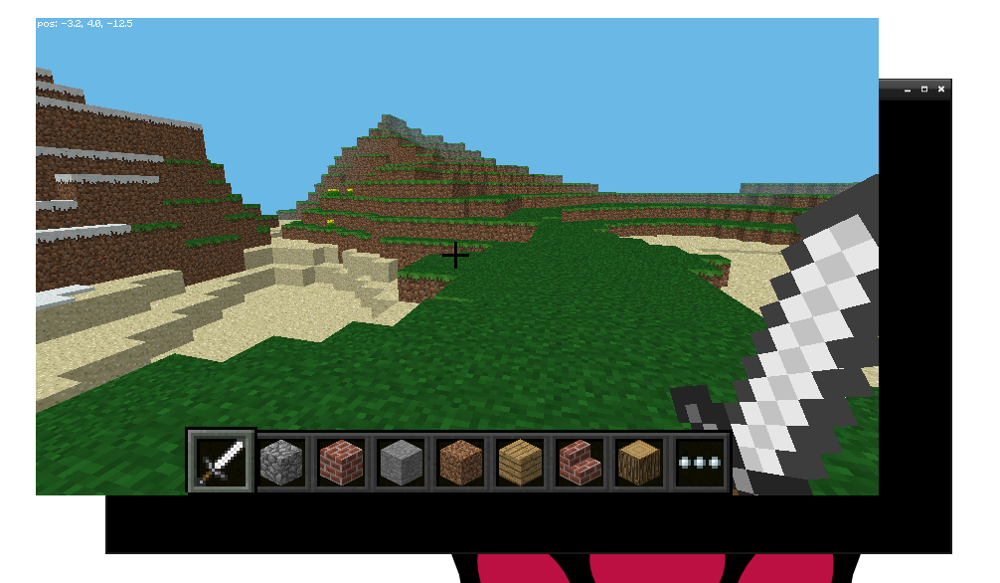
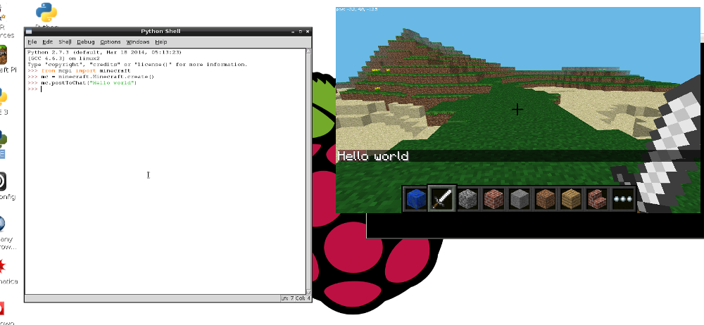

## Ce dont tu auras besoin

### Logiciel

#### Installation du logiciel

Minecraft est installé par défaut dans Raspbian depuis septembre 2014.


Si tu utilises une ancienne version de Raspbian, ouvre une fenêtre de terminal et tape les commandes suivantes (tu dois être en ligne) :

```bash
sudo apt-get update
sudo apt-get install minecraft-pi
```

Une fois cela terminé, Minecraft Pi et la bibliothèque Python devraient être installés.

#### Tester Minecraft

Pour exécuter Minecraft, double-clique sur l'icône du bureau ou tape la commande `minecraft-pi` dans le terminal.


Une fois Minecraft lancé, clique sur **Start Game**, suivi de **Create New**. Tu remarqueras que la fenêtre contenant est légèrement décalée. Cela signifie que pour faire glisser la fenêtre, tu dois saisir la barre de titre derrière la fenêtre Minecraft.



Tu es maintenant dans une partie de Minecraft!

#### Tester Python

Avec Minecraft en cours d'exécution, et le monde créé, éloignez-vous du jeu en appuyant sur la touche `Tab` qui libérera votre souris. Ouvre Python 3 (IDLE) sur le bureau et déplace les fenêtres pour qu'elles soient côte à côte.

Tu peux taper soit des commandes directement dans la fenêtre Python ou créer un fichier afin de pouvoir enregistrer ton code et le réexécuter une autre fois.

Si tu veux créer un fichier, va dans `File > New File` et `File > Save `. Tu voudras probablement l'enregistrer dans votre dossier de départ ou dans un nouveau dossier spécifique à ton projet.

Commence par importer la bibliothèque Minecraft, crée une connexion au jeu et teste-la en affichant le message «Hello world» (bonjour le monde) à l'écran:

```python
from mcpi import minecraft

mc = minecraft.Minecraft.create()

mc.postToChat("Hello world")
```

Si tu entres des commandes directement dans la fenêtre Python, appuie simplement sur `Entrer` après chaque ligne. S'il s'agit d'un fichier, enregistre avec `Ctrl + S` et exécute avec `F5`. Lorsque ton code s'exécute, tu devrais voir ton message dans l'écran du jeu.



Si tu vois "Hello world" dans la fenêtre Minecraft, tu es prêt à passer à l'étape suivante.