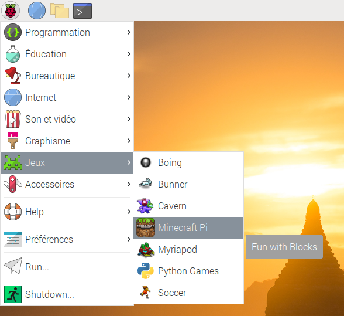
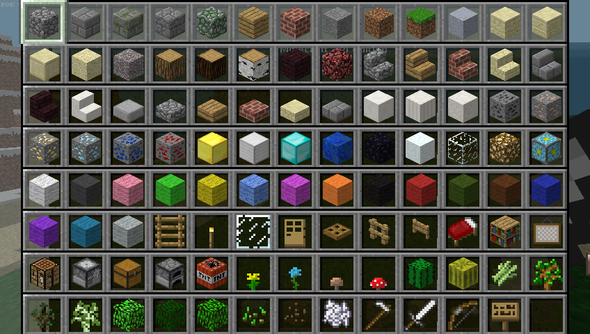
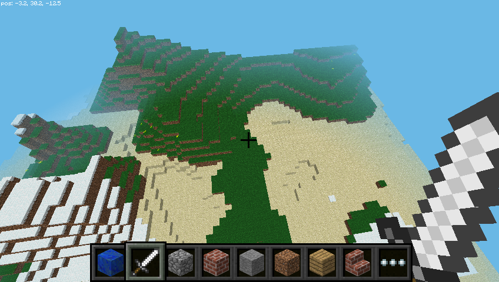

## Exécuter Minecraft

Pour exécuter Minecraft Pi, ouvre-le à partir du menu du bureau ou tape `minecraft-pi` dans le terminal.

Une fois Minecraft lancé, clique sur **Start Game**, suivi de **Create New**. Tu remarqueras que la fenêtre est légèrement décalée. Cela signifie que pour faire glisser la fenêtre, tu dois saisir la barre de titre derrière la fenêtre Minecraft.

Tu es maintenant dans une partie de Minecraft! Va te promener, hacker des trucs et construire des choses!

Utilise la souris pour regarder autour de toi et utilise les touches suivantes sur le clavier:

|    Touche     |              Action              |
|:-------------:|:--------------------------------:|
|       W       |              Avant               |
|       A       |              Gauche              |
|       S       |             Arrière              |
|       D       |              Droite              |
|       E       |            Inventaire            |
|    Espace     |              Sauter              |
| Double espace |          Voler / Tomber          |
|      Esc      |       Pause / Menu du Jeu        |
|      Tab      | Relâcher le curseur de la souris |

Tu peux sélectionner un élément dans le panneau de dessin rapide avec la molette de défilement de la souris (ou utiliser les chiffres de ton clavier), ou appuyer sur `E` et sélectionner quelque chose dans l'inventaire.

Tu peux également appuyer deux fois sur la barre d'espace pour voler dans les airs. Tu arrêteras de voler lorsque tu relâcheras la barre d'espace, et si tu appuies deux fois dessus à nouveau, tu retomberas au sol.

Avec l'épée à la main, tu peux cliquer sur des blocs devant toi pour les supprimer (ou pour creuser). Avec un bloc dans ta main, tu peux utiliser le clic droit pour placer ce bloc devant toi, ou le clic gauche pour supprimer un bloc.