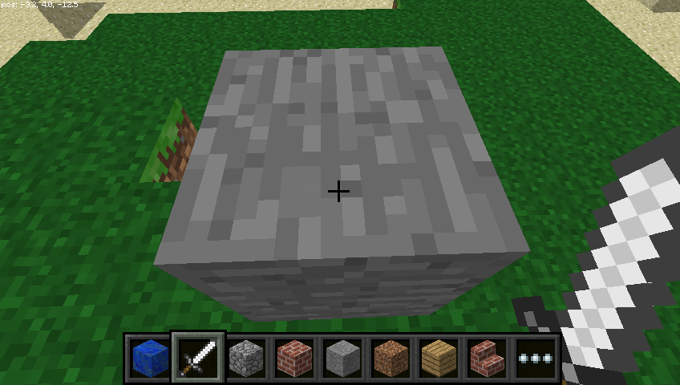
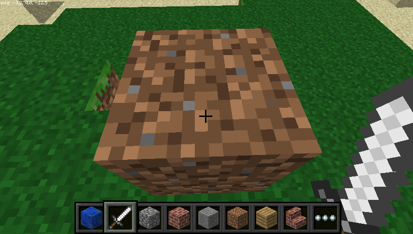
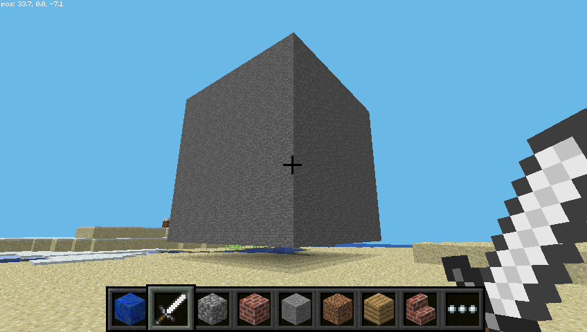

## Utiliser l'interface de programmation Python

Avec Minecraft en cours d'exécution, et le monde créé, éloigne-toi du jeu en appuyant sur la touche `Tab` ce qui libérera ta souris. Ouvre Python 3 (IDLE) sur le bureau et déplace les fenêtres pour qu'elles soient côte à côte.

Tu peux soit taper des commandes directement dans la fenêtre Python ou créer un fichier afin de pouvoir enregistrer ton code et le réexécuter une autre fois.

Si tu veux créer un fichier, va dans `File > New File` et `File > Save`. Tu voudras probablement l'enregistrer dans ton dossier de départ ou dans un nouveau dossier spécifique à ton projet.

Commence par importer la bibliothèque Minecraft, crée une connexion au jeu et teste-la en affichant le message «Hello world» (bonjour le monde) à l'écran:

```python
from mcpi.minecraft import Minecraft

mc = Minecraft.create()

mc.postToChat("Hello world")
```

Si tu entres des commandes directement dans la fenêtre Python, appuie simplement sur `Entrer` après chaque ligne. S'il s'agit d'un fichier, enregistre avec `Ctrl + S` et exécute avec `F5`. Lorsque ton code s'exécute, tu devrais voir ton message dans l'écran du jeu.


### Trouver ta position

Pour trouver ta position, tape :

```python
pos = mc.player.getPos ()
```

`pos` contient maintenant ta position; accède à chaque partie de ces coordonnées avec `pos.x`, `pos.y` et `pos.z`.

Alternativement, une bonne façon d'obtenir les coordonnées dans des variables séparées est d'utiliser la technique de décomposition de Python:

```python
x, y, z = mc.player.getPos ()
```

Maintenant `x`, `y`, et `z` contiennent chaque partie de tes coordonnées de position. `x` et `z` sont les directions de marche (avant/arrière et gauche/droite) et `y` est haut/bas.

Note que `getPos ()` renvoie l'emplacement du joueur à ce moment-là, et si tu déplaces la position, tu dois appeler à nouveau la fonction ou utiliser l'emplacement stocké.

### Se téléporter

En plus de connaître ta position actuelle, tu peux spécifier un emplacement particulier vers lequel te téléporter.

```python
x, y, z = mc.player.getPos()
mc.player.setPos(x, y+100, z)
```

Cela transportera ton joueur de 100 cases dans les airs. Cela signifie que tu te téléporteras au milieu du ciel et que tu retomberas directement là où tu as commencé.

Essaye de te téléporter ailleurs!

### Définir le bloc

Tu peux placer un seul bloc à un ensemble donné de coordonnées avec `mc.setBlock ()`:

```python
x, y, z = mc.player.getPos()
mc.setBlock(x+1, y, z, 1)
```

Maintenant, un bloc de pierre devrait apparaître à côté de l'endroit où tu te trouves. Si ce n'est pas immédiatement devant toi, il se peut que ce soit à côté ou derrière toi. Reviens à la fenêtre Minecraft et utilise la souris pour tourner sur place jusqu'à ce que tu voies un bloc gris directement devant toi.



Les arguments passés au `setBloc` sont `x`, `y`, `z` et `id`. Le `(x, y, z)` fait référence à la position dans le monde (nous avons spécifié un bloc ailleurs de l'endroit où se trouve le joueur avec `x + 1`) et le `id` fait référence au type de bloc que nous aimerions placer. `1` est de la pierre.

D'autres blocs que tu peux essayer:

    Air : 0
    Herbe : 2
    Terre : 3
    

Maintenant, avec le bloc en vue, essaye de le changer en autre chose:

```python
mc.setBlock(x+1, y, z, 2)
```

Tu devrais voir le bloc de pierre grise changer devant tes yeux!



#### Constantes de bloc

Tu peux utiliser des constantes de bloc intégrées pour définir tes blocs, si tu connais leurs noms. Tu auras toutefois besoin d'une autre ligne `importer` en premier.

```python
from mcpi import block
```

Tu peux maintenant écrire ce qui suit pour placer un bloc:

```python
mc.setBlock(x+3, y, z, block.STONE.id)
```

Les identifiants de bloc sont assez faciles à deviner (si on connait l'anglais), écris les simplement en MAJUSCULES. Voici quelques exemples pour t'habituer à la façon dont ils sont nommés.

    WOOD_PLANKS
    WATER_STATIONARY
    GOLD_ORE
    GOLD_BLOCK
    DIAMOND_BLOCK
    NETHER_REACTOR_CORE
    

### Bloc comme variable

Si tu connais l'identifiant d'un bloc, il peut être utile de le définir comme variable. Tu peux utiliser le nom de l'identifiant ou son ID en forme de nombre entier.

```python
dirt = 3
mc.setBlock(x, y, z, dirt)
```

ou

```python
dirt = block.DIRT.id
mc.setBlock(x, y, z, dirt)
```

### Blocs spéciaux

Certains blocs ont des propriétés supplémentaires, comme la laine qui a un paramètre additionnel, tu peux en spécifier la couleur. Pour définir cela, utilise le quatrième paramètre optionnel dans `setBlock`:

```python
wool = 35
mc.setBlock(x, y, z, wool, 1)
```

Ici, le quatrième paramètre `1` règle la couleur de la laine à l'orange. Sans le quatrième paramètre, il est réglé sur la valeur par défaut (`0`) qui est le blanc. Quelques autres couleurs sont:

    2: magenta
    3: bleu clair
    4: jaune
    

Essaie quelques nombres supplémentaires et regarde le bloc changer!

D'autres blocs ayant des propriétés supplémentaires sont le bois (`17`): chêne, épicéa, bouleau, etc. les herbes hautes (`31`): arbuste, herbe, fougère; torche (`50`): pointant vers l'est, l'ouest, le nord, le sud; et plus encore. Consulte la [référence de la librairie](http://www.stuffaboutcode.com/p/minecraft-api-reference.html) pour plus de détails.

### Définir plusieurs blocs

En plus de définir un seul bloc avec `setBlock` tu peux remplir un volume d'espace en une fois avec `setBlocks`:

```python
stone = 1
x, y, z = mc.player.getPos()
mc.setBlocks(x+1, y+1, z+1, x+11, y+11, z+11, stone)
```

Cela remplira un cube 10 x 10 x 10 de pierre solide.



Tu peux créer de plus gros volumes avec la fonction `setBlocks` mais cela peut prendre plus de temps pour les générer !