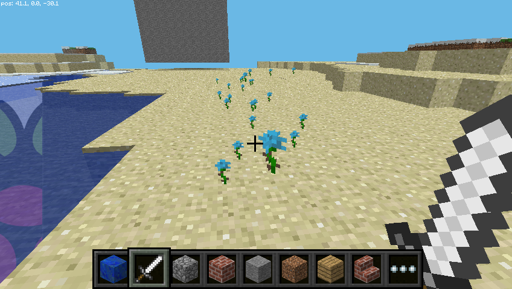
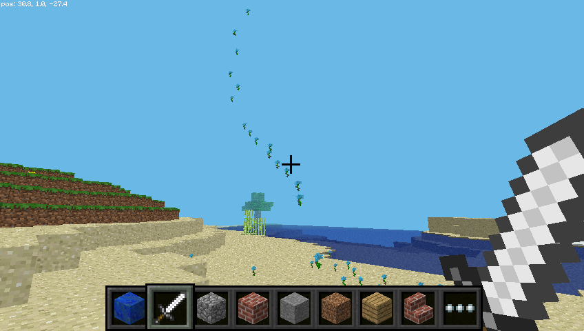
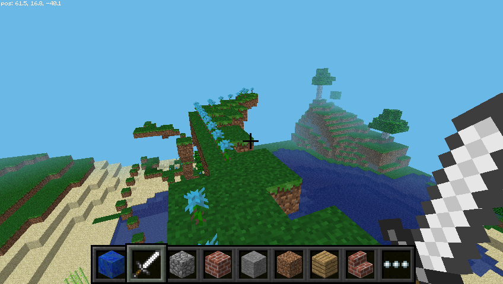

## Laisser tomber des blocs en marchant

Maintenant que tu sais comment déposer des blocs, utilisons notre emplacement de déplacement pour déposer des blocs lorsque tu marches.

Le code suivant laissera tomber une fleur derrière toi partout où tu marcheras:

```python
from mcpi.minecraft import Minecraft
from time import sleep

mc = Minecraft.create()

flower = 38

while True:
    x, y, z = mc.player.getPos()
    mc.setBlock(x, y, z, flower)
    sleep(0.1)
```

Maintenant, avance pendant un moment et fais demi-tour pour voir les fleurs que tu as laissées derrière toi.



Puisque nous avons utilisé une boucle `while True` , cela durera indéfiniment. Pour l'arrêter, appuie sur `Ctrl + C` dans la fenêtre Python.

Essaye de voler dans les airs et regarde les fleurs que tu laisses dans le ciel:



Et si nous voulions seulement déposer des fleurs lorsque le joueur marche sur l'herbe? Nous pouvons utiliser `getBlock` pour savoir de quel type est un bloc :

```python
x, y, z = mc.player.getPos()  # player position (x, y, z)
this_block = mc.getBlock(x, y, z)  # block ID
print(this_block)
```

Cela t'indique l'emplacement du bloc sur lequel tu te trouves (ce sera `0` - un bloc air). Nous voulons savoir *sur* quel type de bloc nous nous tenons . Pour cela, soustrayons 1 de `y` et utilisons `getBlock ()` pour déterminer sur quel type de bloc nous nous tenons:

```python
x, y, z = mc.player.getPos()  # player position (x, y, z)
block_beneath = mc.getBlock(x, y-1, z)  # block ID
print(block_beneath)
```

Cela nous indique l'ID du bloc sur lequel se trouve le joueur.

Teste cela en exécutant une boucle pour imprimer l'ID du bloc sur n'importe lequel tu te trouves actuellement:

```python
while True:
    x, y, z = mc.player.getPos()
    block_beneath = mc.getBlock(x, y-1, z)
    print(block_beneath)
```


Nous pouvons utiliser un `if` pour choisir de planter ou non une fleur:

```python
grass = 2
flower = 38

while True:
    x, y, z = mc.player.getPos()  # player position (x, y, z)
    block_beneath = mc.getBlock(x, y-1, z)  # block ID

    if block_beneath == grass:
        mc.setBlock(x, y, z, flower)
    sleep(0.1)
```

Peut-être pourrions-nous ensuite transformer la dalle sur laquelle nous sommes debout en herbe si ce n'est pas déjà de l'herbe :

```python
if block_beneath == grass:
    mc.setBlock(x, y, z, flower)
else:
    mc.setBlock(x, y-1, z, grass)
```

Maintenant, nous pouvons avancer et si nous marchons sur l'herbe, nous laisserons une fleur derrière nous. Si le bloc suivant n'est pas de l'herbe, il se transforme en herbe. Lorsque nous nous retournons et revenons en arrière, nous laissons maintenant une fleur derrière nous.

