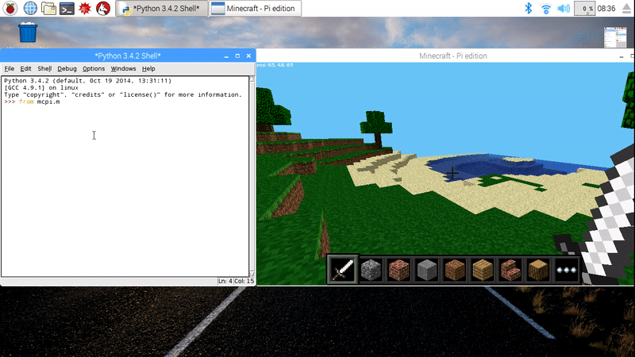
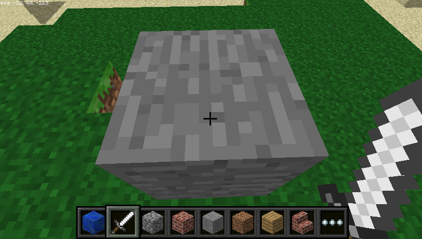
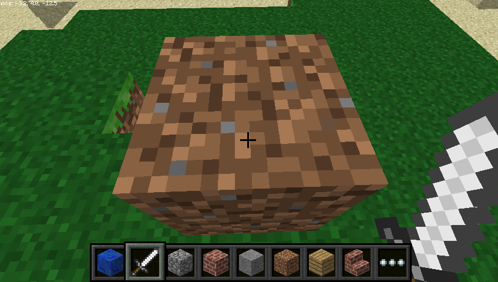
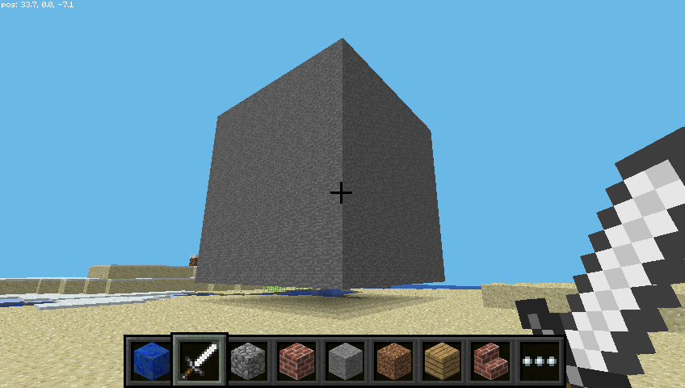

## Python प्रोग्रामिंग इंटरफेस का उपयोग करें

जब Minecraft चल रहा हो, और दुनिया तैयार हो, तो `Tab` (टैब) कुंजी को दबाकर अपना ध्यान गेम से हटा लें, जिससे आपका माउस मुक्त हो जाएगा। एप्लीकेशन मेनू से Python 3 खोलें और विंडोज़ को खिसकाएँ ताकि दोनों एक दूसरे के आस-पास हों।

आप कमांड या तो सीधे Python विंडो में टाइप कर सकते हैं या एक फाइल बना सकते हैं ताकि आप अपना कोड सहेज सकें और इसे बाद में फिर से चला सकें।

यदि आप एक फ़ाइल बनाना चाहते हैं तो `File > New window` और `File > Save` पर जाएँ। आप शायद इसे अपने होम फ़ोल्डर या किसी नए प्रोजेक्ट फ़ोल्डर में सहेजना चाहेंगे।

Minecraft लाइब्रेरी को आयात करके, गेम से कनेक्शन बनाकर और स्क्रीन पर "Hello world" ("हैलो वर्ल्ड") संदेश पोस्ट करके इसका परीक्षण करना प्रारंभ करें:

```python
from mcpi.minecraft import Minecraft

mc = Minecraft.create()

mc.postToChat("Hello world")
```

यदि आप सीधे Python विंडो में कमांड दर्ज कर रहे हैं, तो बस प्रत्येक पंक्ति के बाद `Enter` (एंटर) दबाएँ। यदि यह फ़ाइल है, तो `Ctrl + S` के साथ सहेजें और `F5` के साथ चलाएँ। जब आपका कोड चलता है, तो आपको गेम में स्क्रीन पर अपना संदेश दिखना चाहिए।



### अपनी लोकेशन ढूँढें

अपनी लोकेशन ढूँढने के लिए, टाइप करें:

```python
pos = mc.player.getPos()
```

`pos` में अब आपकी लोकेशन सम्मिलित है; `pos.x`, `pos.y` और `pos.z` के साथ कोऑर्डिनेट्स (निर्देशांकों) के सेट के प्रत्येक हिस्से को एक्सेस करें।

वैकल्पिक रूप से, अलग-अलग वेरिएबल में निर्देशांक प्राप्त करने का एक अच्छा तरीका है Python की अनपैकिंग तकनीक का उपयोग करना:

```python
x, y, z = mc.player.getPos()
```

अब `x`, `y`, और `z` आपकी स्थिति निर्देशांक के प्रत्येक भाग में शामिल हैं। `x` और `z` चलने की दिशाएँ (आगे/पीछे और बाएँ/दाएँ) हैं और `y` ऊपर/नीचे है।

ध्यान दें कि `getPos()` उस समय खिलाड़ी के स्थान को दर्शाता है, और यदि आप स्थिति को बदल देते हैं तो आपको फ़ंक्शन को फिर से कॉल करना होगा या संगृहीत लोकेशन का उपयोग करना होगा।

### टेलीपोर्ट

अपनी वर्तमान लोकेशन को ढूँढने के साथ-साथ आप टेलीपोर्ट करने के लिए कोई विशेष स्थान निर्दिष्ट कर सकते हैं।

```python
x, y, z = mc.player.getPos()
mc.player.setPos(x, y+100, z)
```

यह आपके खिलाड़ी को हवा में 100 स्पेस तक पहुँचाएगा। इसका मतलब यह होगा कि आप आकाश के बीच में टेलीपोर्ट करेंगे और सीधे नीचे वहाँ तक गिर जाएँगे, जहाँ से आपने शुरू किया था।

किसी और जगह पर टेलीपोर्ट करने का प्रयास करें!

### ब्लॉक सेट करें

आप `mc.setBlock()` के साथ निर्देशांक के दिए गए किसी सेट पर केवल एक अकेला ब्लॉक डाल सकते हैं:

```python
x, y, z = mc.player.getPos()
mc.setBlock(x+1, y, z, 1)
```

अब आप जहाँ खड़े हैं, उसके बगल में अब एक पत्थर का ब्लॉक दिखाई देना चाहिए। यदि यह एकदमआपके सामने नहीं है तो यह आपके बगल में या पीछे हो सकता है। Minecraft विंडो पर वापस आएँ और उस जगह पर घूमने के लिए स्पिन करने के लिए तब तक माउस का उपयोग करें जब तक आप सीधे अपने सामने एक भूरे रंग के ब्लॉक को न देख लें।



`set block` (ब्लॉक सेट करें) के लिए दिए गए तर्क हैं `x`, `y`, `z` और `id`। `(x, y, z)` दुनिया में स्थिति को संदर्भित करता है (हमने उस स्थान से एक ब्लॉक दूर निर्दिष्ट किया जहाँ से खिलाड़ी `x + 1`) के साथ खड़ा है और `id` ब्लॉक के उस प्रकार को संदर्भित करता है जिसे हम रखना चाहते हैं। `1` पत्थर है।

अन्य ब्लॉक जिन्हें आप आजमा सकते हैं:

    हवा:   0
    घास: 2
    गंदगी:  3
    

अब ब्लॉक दिखाई देने पर, इसे किसी और चीज़ में बदलने का प्रयास करें:

```python
mc.setBlock(x+1, y, z, 2)
```

आपको अपनी आँखों के सामने भूरे पत्थर का ब्लॉक बदलता हुआ दिखना चाहिए!



#### ब्लॉक स्थिरांक

आप अपने ब्लॉक सेट करने के लिए इनबिल्ट ब्लॉक स्थिरांक का उपयोग कर सकते हैं, बशर्ते आप उनके नाम जानते हों। हालांकि आपको पहले एक और `import` (आयात) लाइन की आवश्यकता होगी।

```python
mcpi (एमसीपीआई) आयात ब्लॉक से
```

अब आप किसी ब्लॉक को रखने के लिए निम्नलिखित लिख सकते हैं:

```python
mc.setBlock(x+3, y, z, block.STONE.id)
```

ब्लॉक आईडी अनुमान लगाने में बहुत आसान होते हैं, बस सभी अक्षर कैपिटल में लिखें, लेकिन यहाँ कुछ उदाहरण दिए गए हैं जिनसे आप उनके नामकरण करने के तरीके से परिचित हो सकें।

    WOOD_PLANKS
    WATER_STATIONARY
    GOLD_ORE
    GOLD_BLOCK
    DIAMOND_BLOCK
    NETHER_REACTOR_CORE
    

### ब्लॉक वेरिएबल के रूप में

यदि आपको ब्लॉक की आईडी पता है तो यह इसे वेरिएबल के रूप में सेट करने के लिए उपयोगी हो सकती है। आप नाम का उपयोग कर सकते हैं या integer id (पूरे नाम की पहचान) का।

```python
dirt = 3
mc.setBlock(x, y, z, dirt)
```

या

```python
dirt = block.DIRT.id
mc.setBlock(x, y, z, dirt)
```

### विशेष ब्लॉक

कुछ ऐसे ब्लॉक हैं जिनमें अतिरिक्त गुण हैं, जैसे ऊन जिसमें एक अतिरिक्त सेटिंग है जिससे आप रंग निर्दिष्ट कर सकते हैं। इसे सेट करने के लिए वैकल्पिक चौथे पैरामीटर `setBlock` (ब्लॉक सेट करें) का उपयोग करें।

```python
wool = 35
mc.setBlock(x, y, z, wool, 1)
```

यहाँ चौथा पैरामीटर `1` ऊन के रंग को नारंगी रंग के रूप में सेट करता है। चौथे पैरामीटर के बिना यह डिफ़ॉल्ट (`0`) पर सेट है जो सफेद है। कुछ और रंग हैं:

    2: मैजेंटा
    3: लाइट ब्लू
    4: पीला
    

कुछ और संख्याओं को आजमाएँ और ब्लॉक को बदलता हुआ देखें!

अतिरिक्त गुणों वाले अन्य ब्लॉक हैं लकड़ी (`17`): ओक (बलूत), स्प्रूस (देवदार), बर्च (बेंत), आदि; लंबी घास (`31`): झाड़ी, घास, फर्न; मशाल (`50`): पूर्व, पश्चिम, उत्तर, दक्षिण की ओर संकेत करने वाले; तथा और बहुत से। पूर्ण विवरण के लिए [API reference](http://www.stuffaboutcode.com/p/minecraft-api-reference.html) (API संदर्भ) देखें।

### एकाधिक ब्लॉक सेट करें

`setBlock` के साथ एक अकेला ब्लॉक बनाने के साथ-साथ आप `setBlocks` के साथ एक ही बार में काफी सारी जगह भी भर सकते हैं:

```python
stone = 1
x, y, z = mc.player.getPos()
mc.setBlocks(x+1, y+1, z+1, x+11, y+11, z+11, stone)
```

इससे 10 x 10 x 10 घन ठोस पत्थर भर जाएगा।



आप `setBlocks` फंक्शन के साथ बड़ी मात्रा में ब्लॉक बना सकते हैं लेकिन इन्हें तैयार करने में अधिक समय लग सकता है!