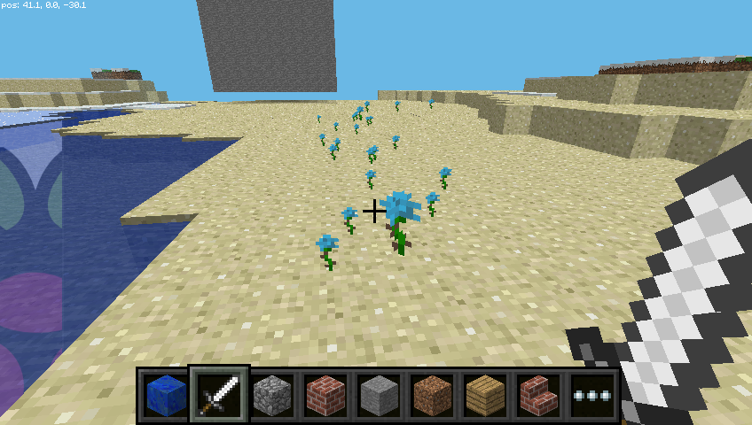
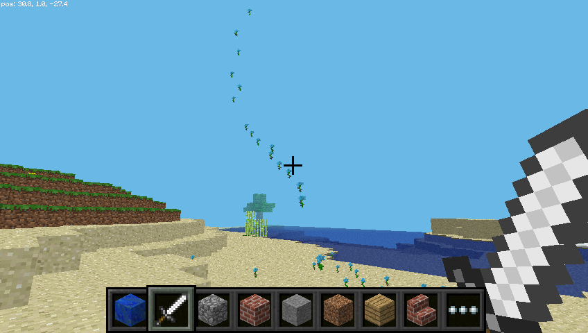
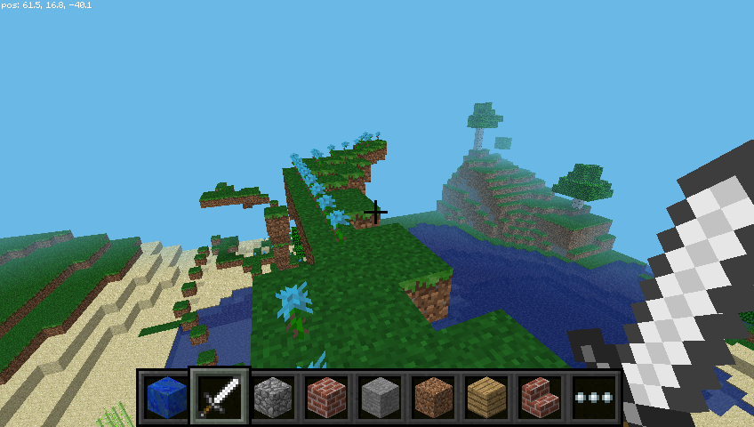

## आपके चलने के साथ-साथ ब्लॉक गिराना

अब आप जानते हैं कि ब्लॉक कैसे गिराए जाते हैं, आइए हम अपनी चलने की लोकेशन का उपयोग आपके चलते समय ब्लॉक गिराने के लिए करें।

निम्नलिखित कोड आप जहाँ कहीं भी आप चलेंगे आपके पीछे एक फूल गिरा देगा:

```python
from mcpi.minecraft import Minecraft
from time import sleep

mc = Minecraft.create()

flower = 38

while True:
    x, y, z = mc.player.getPos()
    mc.setBlock(x, y, z, flower)
    sleep(0.1)
```

अब थोड़ी देर के लिए आगे चलें और पीछे मुड़कर अपने पीछे छोड़े गए फूलों को देखें।



चूंकि हमने `while True` (जबकि यह सच है) लूप का उपयोग किया था यह हमेशा चलता रहेगा। इसे बंद करने के लिए, Python विंडो में `Ctrl + C` दबाएँ।

हवा में उड़ने की कोशिश करें और आकाश में छोड़े गए फूलों को देखें:



यदि हम केवल तभी फूल गिराना चाहते हैं जब खिलाड़ी घास पर चल रहा हो तो क्या होगा? यह पता लगाने के लिए कि कोई ब्लॉक किस प्रकार है हम `getBlock` का उपयोग कर सकते हैं:

```python
x, y, z = mc.player.getPos()  # player position (x, y, z)
this_block = mc.getBlock(x, y, z)  # block ID
print(this_block)
```

यह आपको उस ब्लॉक की लोकेशन बताता है *जिसमें*आप खड़े हैं (यह `0` होगा - एक वायु ब्लॉक)। हम जानना चाहते हैं कि हम किस प्रकार का ब्लॉक *पर* खड़े हैं। इसके लिए हम `y` मूल्य से 1 घटाते हैं और `getBlock()` का उपयोग करते हैं ताकि यह निर्धारित किया जा सके कि हम किस प्रकार के ब्लॉक पर खड़े हैं:

```python
x, y, z = mc.player.getPos()  # player position (x, y, z)
block_beneath = mc.getBlock(x, y-1, z)  # block ID
print(block_beneath)
```

यह हमें उस ब्लॉक की आईडी बताता है जिस पर खिलाड़ी खड़ा है।

आप वर्तमान में जहाँ पर भी खड़े हैं, उसकी ब्लॉक आईडी को मुद्रित करने के लिए लूप चलाकर इसका परीक्षण करें:

```python
while True:
    x, y, z = mc.player.getPos()
    block_beneath = mc.getBlock(x, y-1, z)
    print(block_beneath)
```


यह चुनने के लिए कि हम कोई फूल लगाएँगे या नहीं हम एक `if` (यदि) कथन का उपयोग कर सकते हैं:

```python
grass = 2
flower = 38

while True:
    x, y, z = mc.player.getPos()  # player position (x, y, z)
    block_beneath = mc.getBlock(x, y-1, z)  # block ID

    if block_beneath == grass:
        mc.setBlock(x, y, z, flower)
    sleep(0.1)
```

शायद इसके बाद हम जिस टाइल पर खड़े हैं उसे हम घास में बदल सकते हैं यदि यह पहले से घास नहीं है:

```python
if block_beneath == grass:
    mc.setBlock(x, y, z, flower)
else:
    mc.setBlock(x, y-1, z, grass)
```

अब हम आगे बढ़ सकते हैं और यदि हम घास पर चलते हैं, तो हम पीछे एक फूल छोड़ देंगे। यदि अगला ब्लॉक घास नहीं है, तो यह घास में बदल जाता है। जब हम घूम जाते हैं और वापस चलते हैं, तो अब हम अपने पीछे एक फूल छोड़ देते हैं।

