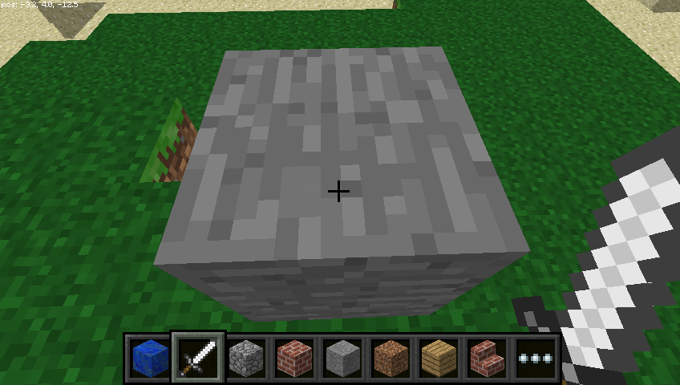
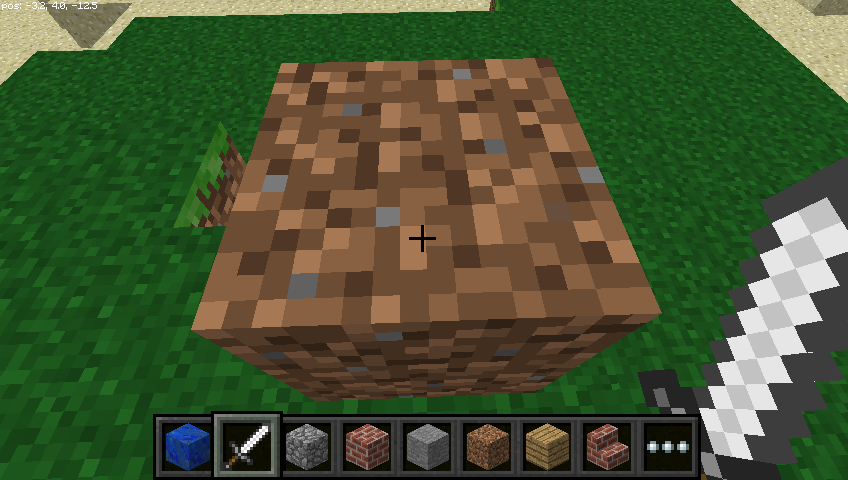

## Python ಪ್ರೋಗ್ರಾಮಿಂಗ್ ಇಂಟರ್ಫೇಸ್ ಬಳಸಿ

Minecraft ಚಾಲನೆಯಲ್ಲಿರುವಾಗ ಮತ್ತು ಪ್ರಪಂಚವನ್ನು ರಚಿಸಿದ ನಂತರ, `Tab` (ಟ್ಯಾಬ್) ಕೀ ಅನ್ನು ಒತ್ತುವ ಮೂಲಕ ನಿಮ್ಮ ಗಮನವನ್ನು ಆಟದಿಂದ ಬದಲಿಸಿ ದೂರವಿಡಿ, ಅದು ನಿಮ್ಮ ಮೌಸ್ ಅನ್ನು ಮುಕ್ತಗೊಳಿಸುತ್ತದೆ. ಅಪ್ಲಿಕೇಶನ್ ಮೆನುವಿನಿಂದ Python 3 ಅನ್ನು ತೆರೆಯಿರಿ ಮತ್ತು ವಿಂಡೋಗಳನ್ನು ಸರಿಸಿ. ಇದರಿಂದ ಅವು ಅಕ್ಕಪಕ್ಕದಲ್ಲಿರುತ್ತವೆ.

ನೀವು ಆಜ್ಞೆಗಳನ್ನು ನೇರವಾಗಿ Python ವಿಂಡೋಗೆ ಟೈಪ್ ಮಾಡಬಹುದು ಅಥವಾ ಫೈಲ್ ಅನ್ನು ರಚಿಸಬಹುದು. ಇದರಿಂದ ನಿಮ್ಮ ಕೋಡ್ ಅನ್ನು ಉಳಿಸಬಹುದು ಮತ್ತು ಅದನ್ನು ಮತ್ತೊಮ್ಮೆ ಚಾಲನೆ ಮಾಡಬಹುದು.

ನೀವು ಫೈಲ್ ರಚಿಸಲು ಬಯಸಿದರೆ `File > New window` ಮತ್ತು `File > Save`. ನೀವು ಬಹುಶಃ ಇದನ್ನು ನಿಮ್ಮ ಹೋಮ್ ಫೋಲ್ಡರ್ ಅಥವಾ ಹೊಸ ಪ್ರಾಜೆಕ್ಟ್ ಫೋಲ್ಡರ್ನಲ್ಲಿ ಉಳಿಸಲು ಬಯಸುತ್ತೀರಿ.

Minecraft ಲೈಬ್ರರಿಯನ್ನು ಆಮದು ಮಾಡುವ ಮೂಲಕ ಪ್ರಾರಂಭಿಸಿ, ಆಟಕ್ಕೆ ಸಂಪರ್ಕವನ್ನು ರಚಿಸಿ ಮತ್ತು "Hello world" ("ಹಲೋ ವರ್ಲ್ಡ್") ಸಂದೇಶವನ್ನು ಪರದೆಯ ಮೇಲೆ ಪೋಸ್ಟ್ ಮಾಡುವ ಮೂಲಕ ಅದನ್ನು ಪರೀಕ್ಷಿಸಿ:

```python
from mcpi.minecraft import Minecraft

mc = Minecraft.create()

mc.postToChat("Hello world")
```

ನೀವು ಆಜ್ಞೆಗಳನ್ನು ನೇರವಾಗಿ Python ವಿಂಡೋಗೆ ನಮೂದಿಸುತ್ತಿದ್ದರೆ, ಪ್ರತಿ ಸಾಲಿನ ನಂತರ `Enter` (ಎಂಟರ್) ಅನ್ನು ಒತ್ತಿರಿ. ಇದು ಫೈಲ್ ಆಗಿದ್ದರೆ, `Ctrl + S` ನೊಂದಿಗೆ ಉಳಿಸಿ ಮತ್ತು `F5` ನೊಂದಿಗೆ ಚಲಾಯಿಸಿ. ನಿಮ್ಮ ಕೋಡ್ ಚಾಲನೆಯಲ್ಲಿರುವಾಗ, ಆಟದಲ್ಲಿ ನಿಮ್ಮ ಸಂದೇಶವನ್ನು ಪರದೆಯ ಮೇಲೆ ನೋಡಬೇಕು.


### ನಿಮ್ಮ ಸ್ಥಳವನ್ನು(ಲೊಕೇಷನ್) ಹುಡುಕಿ

ನಿಮ್ಮ ಸ್ಥಳವನ್ನು(ಲೊಕೇಷನ್) ಕಂಡುಹಿಡಿಯಲು, ಟೈಪ್ ಮಾಡಿ:

```python
pos = mc.player.getPos()
```

`pos` ಈಗ ನಿಮ್ಮ ಸ್ಥಳವನ್ನು ಒಳಗೊಂಡಿದೆ; `pos.x`, `pos.y` ಮತ್ತು `pos.z` ನೊಂದಿಗೆ ನಿರ್ದೇಶಾಂಕಗಳ ಗುಂಪಿನ ಪ್ರತಿಯೊಂದು ಭಾಗವನ್ನು ಪ್ರವೇಶಿಸಿ.

ಪರ್ಯಾಯವಾಗಿ, ನಿರ್ದೇಶಾಂಕಗಳನ್ನು ಪ್ರತ್ಯೇಕ ವೇರಿಯೇಬಲ್ಸ್ ಗಳಾಗಿ ಪಡೆಯಲು ಉತ್ತಮ ಮಾರ್ಗವೆಂದರೆ Python ನ ಅನ್ಪ್ಯಾಕ್ ಮಾಡುವ ತಂತ್ರವನ್ನು ಬಳಸುವುದು:

```python
x, y, z = mc.player.getPos()
```

ಈಗ `x`, `y`, ಮತ್ತು `z` ನಿಮ್ಮ ಸ್ಥಾನದ ನಿರ್ದೇಶಾಂಕಗಳ ಪ್ರತಿಯೊಂದು ಭಾಗವನ್ನು ಒಳಗೊಂಡಿರುತ್ತದೆ. `x` ಮತ್ತು `z` ನಡೆಯುವ ನಿರ್ದೇಶನಗಳು (ಮುಂದೆ/ ಹಿಂದೆ ಮತ್ತು ಎಡ/ಬಲ) ಮತ್ತು `y` ಮೇಲೆ/ಕೆಳಗೆ ಆಗಿದೆ.

ಗಮನಿಸಿ, `getPos ()` ಎಂಬುವುದು ಆ ಸಮಯದಲ್ಲಿ ಆಟಗಾರನ ಸ್ಥಳವನ್ನು ಹಿಂದಿರುಗಿಸುತ್ತದೆ, ಮತ್ತು ನೀವು ಸ್ಥಾನವನ್ನು ಸರಿಸಿದರೆ ನೀವು ಮತ್ತೆ ಫನ್ಕ್ಷನ್ ನ ಕರೆಯಬೇಕು ಅಥವಾ ಸಂಗ್ರಹಿಸಿದ ಸ್ಥಳವನ್ನು ಬಳಸಬೇಕು.

### ಟೆಲಿಪೋರ್ಟ್

ನಿಮ್ಮ ಪ್ರಸ್ತುತ ಸ್ಥಳವನ್ನು ಕಂಡುಹಿಡಿಯುವುದರ ಜೊತೆಗೆ ಟೆಲಿಪೋರ್ಟ್ ಮಾಡಲು ನೀವು ನಿರ್ದಿಷ್ಟ ಸ್ಥಳವನ್ನು ಗೊತ್ತುಪಡಿಸಬಹುದು.

```python
x, y, z = mc.player.getPos()
mc.player.setPos(x, y+100, z)
```

ಇದು ನಿಮ್ಮ ಆಟಗಾರರನ್ನು ಗಾಳಿಯಲ್ಲಿ 100 ಸ್ಪೇಸ್ ಗಳಿಗೆ ಸಾಗಿಸುತ್ತದೆ. ಇದರರ್ಥ ನೀವು ಆಕಾಶದ ಮಧ್ಯಕ್ಕೆ ಟೆಲಿಪೋರ್ಟ್ ಮಾಡುತ್ತೀರಿ ಮತ್ತು ನೀವು ಪ್ರಾರಂಭಿಸಿದ ಸ್ಥಳಕ್ಕೆ ನೇರವಾಗಿ ಕೆಳಗೆ ಬೀಳುತ್ತೀರಿ.

ಬೇರೆಡೆಗೆ ಟೆಲಿಪೋರ್ಟ್ ಮಾಡಲು ಪ್ರಯತ್ನಿಸಿ!

### ಬ್ಲಾಕ್ ಅನ್ನು ಹೊಂದಿಸಿ

`mc.setBlock()` ನೊಂದಿಗೆ ನಿರ್ದಿಷ್ಟ ನಿರ್ದೇಶಾಂಕಗಳಲ್ಲಿ ನೀವು ಒಂದೇ ಬ್ಲಾಕ್ ಅನ್ನು ಇರಿಸಬಹುದು:

```python
x, y, z = mc.player.getPos()
mc.setBlock(x+1, y, z, 1)
```

ಈಗ ನೀವು ನಿಂತಿರುವ ಪಕ್ಕದಲ್ಲಿ ಕಲ್ಲಿನ ಬ್ಲಾಕ್ ಕಾಣಿಸಿಕೊಳ್ಳಬೇಕು. ಅದು ತಕ್ಷಣ ನಿಮ್ಮ ಮುಂದೆ ಇಲ್ಲದಿದ್ದರೆ ಅದು ನಿಮ್ಮ ಪಕ್ಕದಲ್ಲಿ ಅಥವಾ ಹಿಂದೆ ಇರಬಹುದು. Minecraft ವಿಂಡೋಗೆ ಹಿಂತಿರುಗಿ ಮತ್ತು ನಿಮ್ಮ ಮುಂದೆ ನೇರವಾಗಿ ಬೂದುಬಣ್ಣದ ಬ್ಲಾಕ್ ಅನ್ನು ನೋಡುವ ತನಕ ಸ್ಥಳದಲ್ಲೇ ತಿರುಗಲು ಮೌಸ್ ಬಳಸಿ.



`set block` ಗೆ ರವಾನಿಸಿದ ವಾದಗಳು `x`, `y`, `z` ಮತ್ತು `id`. `(x, y, z)` ವಿಶ್ವದ ಸ್ಥಾನವನ್ನು ಸೂಚಿಸುತ್ತದೆ (ನಾವು ` x + 1` ನೊಂದಿಗೆ ಆಟಗಾರನು ನಿಂತಿರುವ ಸ್ಥಳದಿಂದ ಒಂದು ಬ್ಲಾಕ್ ದೂರವನ್ನು ನಿರ್ದಿಷ್ಟಪಡಿಸಿದ್ದೇವೆ) ಮತ್ತು `id` ನಾವು ಇರಿಸಲು ಬಯಸುವ ಬ್ಲಾಕ್ ಪ್ರಕಾರವನ್ನು ಸೂಚಿಸುತ್ತದೆ. `1` ಇದು ಕಲ್ಲು.

ನೀವು ಪ್ರಯತ್ನಿಸಬಹುದಾದ ಇತರ ಬ್ಲಾಕ್‌ಗಳು:

    ಗಾಳಿ: 0
    ಹುಲ್ಲು: 2
    ಕೊಳಕು: 3
    

ಈಗ ದೃಷ್ಟಿಯಲ್ಲಿರುವ ಬ್ಲಾಕ್ನೊಂದಿಗೆ, ಅದನ್ನು ಬೇರೆಯದಕ್ಕೆ ಬದಲಾಯಿಸಲು ಪ್ರಯತ್ನಿಸಿ:

```python
mc.setBlock(x+1, y, z, 2)
```

ನಿಮ್ಮ ಕಣ್ಣುಗಳ ಮುಂದೆ ಬೂದು ಕಲ್ಲಿನ ಬ್ಲಾಕ್ ನ ಬದಲಾವಣೆಯನ್ನು ನೀವು ನೋಡಬೇಕು!



#### ಬ್ಲಾಕ್ ಸ್ಥಿರಾಂಕಗಳು

ನಿಮ್ಮ ಬ್ಲಾಕ್ಗಳನ್ನು ಹೊಂದಿಸಲು ನೀವು ಅಂತರ್ಗತ (ಇನ್ಬಿಲ್ಟ್) ಬ್ಲಾಕ್ ಸ್ಥಿರಾಂಕಗಳನ್ನು ಬಳಸಬಹುದು, ಅವುಗಳ ಹೆಸರುಗಳು ನಿಮಗೆ ತಿಳಿದಿದ್ದರೆ. ಅದಕ್ಕಾಗಿ ನಿಮಗೆ ಮೊದಲ ಸಾಲಾಗಿ ಇನ್ನೊಂದು `import` (ಆಮದು) ನ ಅಗತ್ಯವಿದೆ.

```python
from mcpi import block
```

ಬ್ಲಾಕ್ ಅನ್ನು ಇರಿಸಲು ಈಗ ನೀವು ಈ ಕೆಳಗಿನವುಗಳನ್ನು ಬರೆಯಬಹುದು:

```python
mc.setBlock(x+3, y, z, block.STONE.id)
```

ಬ್ಲಾಕ್ ಐಡಿಗಳನ್ನು ಗ್ರಹಿಸಲು ತುಂಬಾ ಸುಲಭ, ಎಲ್ಲಾ ಅಕ್ಷರಗಳನ್ನು ದೊಡ್ಡಕ್ಷರ (ಕ್ಯಾಪಿಟಲ್) ಮಾಡಿ, ಆದರೆ ಅವುಗಳನ್ನು ಹೇಗೆ ಹೆಸರಿಸಬೇಕೆಂದು ನಿಮಗೆ ಪರಿಚಯಿಸಲು ಇಲ್ಲಿ ಕೆಲವು ಉದಾಹರಣೆಗಳಿವೆ.

    WOOD_PLANKS
    WATER_STATIONARY
    GOLD_ORE
    GOLD_BLOCK
    DIAMOND_BLOCK
    NETHER_REACTOR_CORE
    

### ಬ್ಲಾಕ್ ವೇರಿಯಬಲ್ ಆಗಿ

ಬ್ಲಾಕ್ ನ ಐಡಿ ನಿಮಗೆ ತಿಳಿದಿದ್ದರೆ ಅದನ್ನು ವೇರಿಯಬಲ್ ಆಗಿ ಹೊಂದಿಸಲು ಇದು ಉಪಯುಕ್ತವಾಗಿರುತ್ತದೆ. ನೀವು ಹೆಸರು ಅಥವಾ ಪೂರ್ಣಾಂಕ ಐಡಿಯನ್ನು(integer id) ಬಳಸಬಹುದು.

```python
dirt = 3
mc.setBlock(x, y, z, dirt)
```

ಅಥವಾ

```python
dirt = block.DIRT.id
mc.setBlock(x, y, z, dirt)
```

### ವಿಶೇಷ ಬ್ಲಾಕ್ಗಳು

ಹೆಚ್ಚುವರಿ ಗುಣಲಕ್ಷಣಗಳನ್ನು ಹೊಂದಿರುವ ಕೆಲವು ಬ್ಲಾಕ್‌ಗಳಿವೆ, ಉದಾಹರಣೆಗೆ ಉಣ್ಣೆ. ಉಣ್ಣೆಗೆ ಹೆಚ್ಚುವರಿ ಸೆಟ್ಟಿಂಗ್ ಆಗಿ, ನೀವು ಬಣ್ಣವನ್ನು ನಿರ್ದಿಷ್ಟಪಡಿಸಬಹುದು. ಇದನ್ನು ಹೊಂದಿಸಲು `setBlock` ನಲ್ಲಿ ಐಚ್ಛಿಕ ನಾಲ್ಕನೇ ನಿಯತಾಂಕವನ್ನು ಬಳಸಿ:

```python
wool = 35
mc.setBlock(x, y, z, wool, 1)
```

ಇಲ್ಲಿ ನಾಲ್ಕನೇ ನಿಯತಾಂಕ `1` ಉಣ್ಣೆಯ ಬಣ್ಣವನ್ನು ಕಿತ್ತಳೆ ಬಣ್ಣಕ್ಕೆ ಹೊಂದಿಸುತ್ತದೆ. ನಾಲ್ಕನೇ ನಿಯತಾಂಕವಿಲ್ಲದೆ ಇದ್ದಲ್ಲಿ, ಇದನ್ನು ಡೀಫಾಲ್ಟ್ ಆಗಿ (`0`) ಗೆ ಹೊಂದಿಸಲಾಗಿದೆ. ಇದು ಬಿಳಿ ಬಣ್ಣವಾಗಿದೆ. ಇನ್ನೂ ಕೆಲವು ಬಣ್ಣಗಳು:

    2: Magenta
    3: Light Blue
    4: Yellow
    

ಇನ್ನೂ ಕೆಲವು ಸಂಖ್ಯೆಗಳನ್ನು ಪ್ರಯತ್ನಿಸಿ ಮತ್ತು ಬ್ಲಾಕ್ ಬದಲಾವಣೆಯನ್ನು ವೀಕ್ಷಿಸಿ!

ಹೆಚ್ಚುವರಿ ಗುಣಲಕ್ಷಣಗಳನ್ನು ಹೊಂದಿರುವ ಇತರ ಬ್ಲಾಕ್ಗಳು ಮರ (`17`): ಓಕ್, ಸ್ಪ್ರೂಸ್, ಬರ್ಚ್, ಇತ್ಯಾದಿ; ಎತ್ತರದ ಹುಲ್ಲು (`31`): ಪೊದೆಸಸ್ಯ, ಹುಲ್ಲು, ಜರೀಗಿಡ; ಟಾರ್ಚ್ (`50`): ಪೂರ್ವ, ಪಶ್ಚಿಮ, ಉತ್ತರ, ದಕ್ಷಿಣಕ್ಕೆ ಸೂಚಿಸುತ್ತದೆ; ಮತ್ತು ಇನ್ನೂ ಅನೇಕ. ಪೂರ್ಣ ವಿವರಗಳಿಗಾಗಿ [API reference](http://www.stuffaboutcode.com/p/minecraft-api-reference.html) (API ಉಲ್ಲೇಖವನ್ನು) ನೋಡಿ.

### ಬಹು ಬ್ಲಾಕ್ಗಳನ್ನು ಹೊಂದಿಸಿ

`setBlocks` ನೊಂದಿಗೆ ಒಂದೇ ಬ್ಲಾಕ್ ಅನ್ನು ರಚಿಸುವುದರ ಜೊತೆಗೆ, ನೀವು `setBlocks` ನೊಂದಿಗೆ ಒಂದೇ ಬಾರಿಗೆ ಸಾಕಷ್ಟು ಜಾಗವನ್ನು ಭರ್ತಿ ಮಾಡಬಹುದು:

```python
stone = 1
x, y, z = mc.player.getPos()
mc.setBlocks(x+1, y+1, z+1, x+11, y+11, z+11, stone)
```

ಇದು 10 x 10 x 10 ಘನ ಘನ ಕಲ್ಲುಗಳನ್ನು ತುಂಬುತ್ತದೆ.


`setBlocks` ಫಂಕ್ಷನ್ ನಿಂದ ನೀವು ದೊಡ್ಡ ಪ್ರಮಾಣದ ಬ್ಲಾಕ್‌ಗಳನ್ನು ರಚಿಸಬಹುದು. ಆದರೆ ಅವುಗಳನ್ನು ತಯಾರಿಸಲು ಹೆಚ್ಚು ಸಮಯ ತೆಗೆದುಕೊಳ್ಳಬಹುದು!