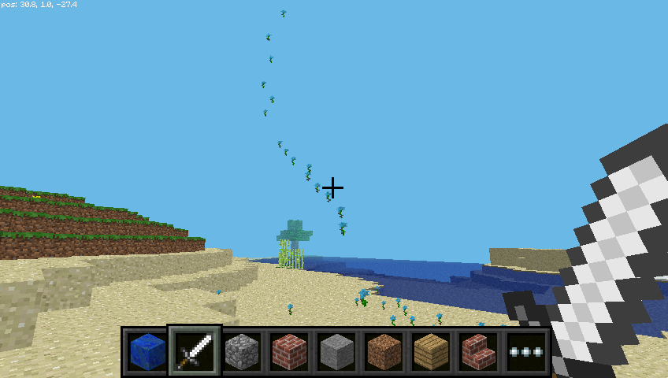
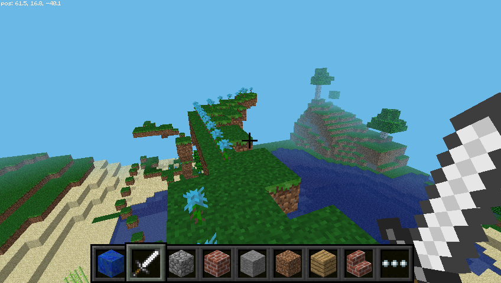

## ನೀವು ನಡೆಯುವಾಗ ಬ್ಲಾಕ್ ಗಳನ್ನು ಬೀಳಿಸುವುದು

ಬ್ಲಾಕ್ಗಳನ್ನು ಹೇಗೆ ಬಿಡುವುದು ಎಂದು ಈಗ ನಿಮಗೆ ತಿಳಿದಿದೆ, ನೀವು ನಡೆಯುವಾಗ ಬ್ಲಾಕ್ಗಳನ್ನು ಬಿಡಲು ನಮ್ಮ ಚಲಿಸುವ ಸ್ಥಳವನ್ನು ಬಳಸೋಣ.

ಈ ಕೆಳಗಿನ ಕೋಡ್ ನೀವು ಎಲ್ಲಿ ನಡೆದರೂ ನಿಮ್ಮ ಹಿಂದೆ ಒಂದು ಹೂವನ್ನು ಬಿಡುತ್ತದೆ:

```python
from mcpi.minecraft import Minecraft
from time import sleep

mc = Minecraft.create()

flower = 38

while True:
    x, y, z = mc.player.getPos()
    mc.setBlock(x, y, z, flower)
    sleep(0.1)
```

ಈಗ ಸ್ವಲ್ಪ ಸಮಯದವರೆಗೆ ನಡೆದು, ನೀವು ಹಿಂದೆ ಬಿಟ್ಟುಹೋದ ಹೂವುಗಳನ್ನು ನೋಡಲು ತಿರುಗಿ.


ನಾವು `while True` ಅನ್ನೋ ಲೂಪ್ ಬಳಸಿದ್ದರಿಂದ, ಇದು ಶಾಶ್ವತವಾಗಿ ಮುಂದುವರಿಯುತ್ತದೆ. ಅದನ್ನು ನಿಲ್ಲಿಸಲು, Python ವಿಂಡೋದಲ್ಲಿ`Ctrl + C` ಒತ್ತಿರಿ.

ಗಾಳಿಯಲ್ಲಿ ಹಾರಲು ಪ್ರಯತ್ನಿಸಿ ಮತ್ತು ನೀವು ಆಕಾಶದಲ್ಲಿ ಬಿಡುವ ಹೂವುಗಳನ್ನು ನೋಡಿ:



ಆಟಗಾರನು ಹುಲ್ಲಿನ ಮೇಲೆ ನಡೆದಾಗ ಮಾತ್ರ ನಾವು ಹೂವುಗಳನ್ನು ಬಿಡಲು ಬಯಸಿದರೆ? ನಾವು `getBlock` ಅನ್ನು ಬಳಸಿ ಬ್ಲಾಕ್ ಯಾವ ಪ್ರಕಾರವಾಗಿದೆ ಎಂದು ಕಂಡುಹಿಡಿಯಬಹುದು:

```python
x, y, z = mc.player.getPos()  # player position (x, y, z)
this_block = mc.getBlock(x, y, z)  # block ID
print(this_block)
```

ನೀವು ನಿಂತಿರುವ ಬ್ಲಾಕ್ನ ಸ್ಥಳವನ್ನು *ಇದು* ನಿಮಗೆ ತಿಳಿಸುತ್ತದೆ ( `0` - ಇದು ಏರ್ ಬ್ಲಾಕ್ ಆಗಿರುತ್ತದೆ). ನಾವು ಯಾವ ರೀತಿಯ ಬ್ಲಾಕ್ *ಮೇಲೆ* ನಿಂತಿದ್ದೇವೆ ಎಂದು ತಿಳಿಯಲು ನಾವು ಬಯಸುತ್ತೇವೆ. ಇದಕ್ಕಾಗಿ ನಾವು `y` ಮೌಲ್ಯದಿಂದ 1 ಅನ್ನು ಕಳೆಯುತ್ತೇವೆ ಮತ್ತು ನಾವು ಯಾವ ರೀತಿಯ ಬ್ಲಾಕ್‌ನಲ್ಲಿ ನಿಂತಿದ್ದೇವೆ ಎಂಬುದನ್ನು ನಿರ್ಧರಿಸಲು `getBlock()` ಅನ್ನು ಬಳಸುತ್ತೇವೆ:

```python
x, y, z = mc.player.getPos()  # player position (x, y, z)
block_beneath = mc.getBlock(x, y-1, z)  # block ID
print(block_beneath)
```

ಇದು ನಮಗೆ ಆಟಗಾರನು ನಿಂತಿರುವ ಬ್ಲಾಕ್ ನ ಐಡಿ ಯನ್ನು ಹೇಳುತ್ತದೆ.

ನೀವು ಪ್ರಸ್ತುತ ನಿಂತಿರುವ ಬ್ಲಾಕ್ ಐಡಿಯನ್ನು ಮುದ್ರಿಸಲು ಲೂಪ್ ಅನ್ನು ಚಲಾಯಿಸುವ ಮೂಲಕ ಇದನ್ನು ಪರೀಕ್ಷಿಸಿ:

```python
while True:
    x, y, z = mc.player.getPos()
    block_beneath = mc.getBlock(x, y-1, z)
    print(block_beneath)
```


ನಾವು ಹೂವನ್ನು ನೆಡಬೇಕೇ ಅಥವಾ ಬೇಡವೇ ಎಂಬುದನ್ನು ಆಯ್ಕೆ ಮಾಡಲು ನಾವು `if` (ವೇಳೆ) ಹೇಳಿಕೆಯನ್ನು ಬಳಸಬಹುದು:

```python
grass = 2
flower = 38

while True:
    x, y, z = mc.player.getPos()  # player position (x, y, z)
    block_beneath = mc.getBlock(x, y-1, z)  # block ID

    if block_beneath == grass:
        mc.setBlock(x, y, z, flower)
    sleep(0.1)
```

ಬಹುಶಃ ಇದರ ನಂತರ, ನಾವು ನಿಂತಿರುವ ಟೈಲ್ ಅನ್ನು ಈಗಾಗಲೇ ಹುಲ್ಲು ಇಲ್ಲದಿದ್ದರೆ ಹುಲ್ಲಿಗೆ ಬದಲಾಯಿಸಬಹುದು:

```python
if block_beneath == grass:
    mc.setBlock(x, y, z, flower)
else:
    mc.setBlock(x, y-1, z, grass)
```

ಈಗ ನಾವು ಮುಂದೆ ನಡೆಯಬಹುದು ಮತ್ತು ನಾವು ಹುಲ್ಲಿನ ಮೇಲೆ ನಡೆದರೆ, ನಾವು ಒಂದು ಹೂವನ್ನು ಬಿಡುತ್ತೇವೆ. ಮುಂದಿನ ಬ್ಲಾಕ್ ಹುಲ್ಲು ಅಲ್ಲದಿದ್ದರೆ, ಅದು ಹುಲ್ಲು ಆಗಿ ಬದಲಾಗುತ್ತದೆ. ನಾವು ತಿರುಗಿ ಹಿಂದಕ್ಕೆ ನಡೆದಾಗ, ನಾವು ಈಗ ನಮ್ಮ ಹಿಂದೆ ಒಂದು ಹೂವನ್ನು ಬಿಡುತ್ತೇವೆ.

