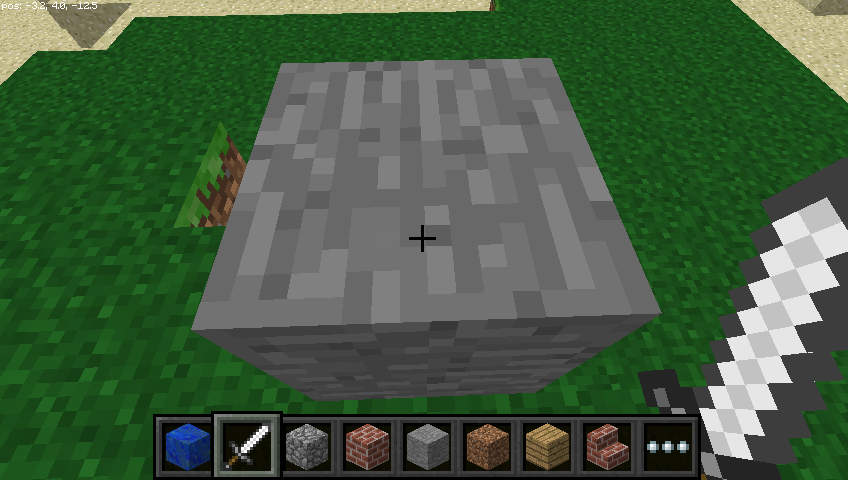
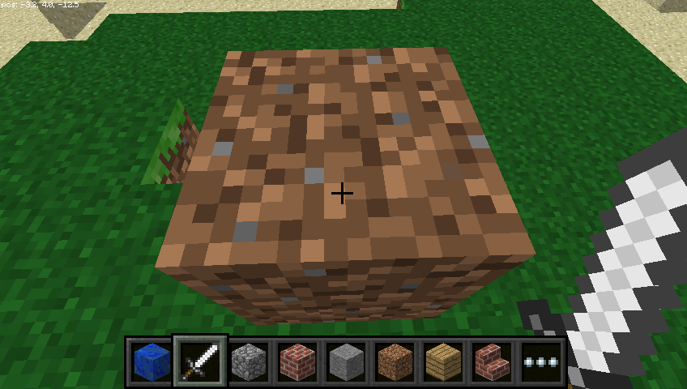
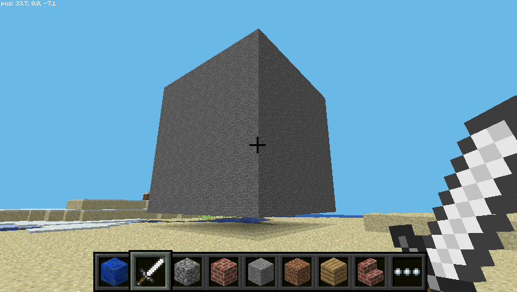

## Python प्रोग्रामिंग इंटरफेसचा वापर करा

जेव्हा Minecraft चालू आहे, आणि जग तयार झाले आहे, तेव्हा `Tab` (टॅब) बटन दाबून आपले लक्ष खेळापासून दूर न्या, ज्यामुळे आपला माउसला मुक्त होईल. अ‍ॅप्लिकेशन मेन्यूमधून Python 3 उघडा आणि विंडोज बाजूला करा जेणेकरून दोघ आजुबाजूला येतील.

आपण Python विंडोमध्ये कमांड टाइप करू शकता किंवा फाइल तयार करू शकता जेणेकरून आपण आपला कोड सेव्ह करू शकता आणि त्यास पुन्हा एकदा चालवू शकाल.

आपणास नवीन फाइल तयार करायची असल्यास `File > New window` आणि `File > Save` चा वापर करा. आपणास हे कदाचित आपल्या होम फोल्डरमध्ये किंवा नवीन प्रोजेक्ट फोल्डरमध्ये सेव्ह करू शकता.

Minecraft लायब्ररी आयात करून, खेळाशी कनेक्शन तयार करुन आणि स्क्रीनवर “Hello world” संदेश पोस्ट करुन त्याची चाचणी करुन प्रारंभ करा:

```python
from mcpi.minecraft import Minecraft

mc = Minecraft.create()

mc.postToChat("Hello world")
```

जर आपण Python विंडोमध्ये थेट कमांड टाइप करीत असाल तर प्रत्येक ओळीनंतर `Enter `(एंटर) दाबा. जर ही फाइल असेल तर, `Ctrl + S` सह सेव्ह करा आणि `F5` सह चालवा. जेव्हा आपला कोड चालू असेल, तेव्हा आपण आपला संदेश गेममध्ये स्क्रीनवर दिसला पाहिजे.


### आपले लोकेशन शोधा

आपले स्थान शोधण्यासाठी, टाइप करा:

```python
pos = mc.player.getPos()
```

`pos` आता आपले स्थान आहे; `pos.x`, `pos.y` आणि `pos.z` च्या बरोबर कोऑर्डिनेट्स च्या संचाच्या प्रत्येक भागाला एक्सेस करा.

वैकल्पिकरित्या, कोऑर्डिनेट्स (निर्देशांक) स्वतंत्र व्हेरिएबल्समध्ये आणण्याचा एक चांगला मार्ग म्हणजे Pythonचे अनपॅकिंग तंत्र वापरणे:

```python
x, y, z = mc.player.getPos()
```

आता `x`, `y`, आणि `z` आपल्या स्थानाच्या कोऑर्डिनेट्सच्या प्रत्येक भागात आहे. `x` आणि `z` चालण्याचे दिशानिर्देश आहेत (पुढे / मागे आणि डावीकडे / उजवीकडे) आणि `y` वर / खाली आहे.

लक्षात घ्या `getPos()` त्या वेळी प्लेअरचे स्थान दर्शविते आणि आपण स्थान हलविल्यास आपल्याला पुन्हा फंक्शन कॉल करावे लागेल किंवा संचयित स्थान वापरावे लागेल.

### टेलिपोर्ट

तसेच आपले वर्तमान स्थान शोधून काढण्यासाठी आपण टेलिपोर्टसाठी विशिष्ट स्थान निर्दिष्ट करू शकता.

```python
x, y, z = mc.player.getPos()
mc.player.setPos(x, y+100, z)
```

हे आपल्या प्लेअरला हवेत 100 स्पेस वर घेऊन जाईल. याचा अर्थ असा की आपण आकाशाच्या मध्यभागी टेलिपोर्ट कराल आणि आपण जिथे प्रारंभ केला तिथे सरळ खाली पडाल.

इतर कोठेतरी टेलिपोर्टिंग करून पहा!

### ब्लॉक सेट करा

आपण `mc.setBlock()` सह निर्देशांकांच्या सेटवर एकच ब्लॉक ठेवू शकता:

```python
x, y, z = mc.player.getPos()
mc.setBlock(x+1, y, z, 1)
```

आता आपण जिथे उभे आहात तिथे आता दगडी ब्लॉक दिसला पाहिजे. जर ते तत्काळ आपल्या समोर नसेल तर ते आपल्या बाजूला किंवा मागे असू शकते. Minecraft विंडोवर परत जा आणि आपल्या समोर राखाडी ब्लॉक दिसत नाही तोपर्यंत जागेवर फिरण्यासाठी माउस वापरा.



`set block`(ब्लॉक सेट करा) ह्या साठी दिलेले तर्क आहेत`x`, `y`, `z` आणि `id`. `(x, y, z)` जगातील स्थिती संदर्भित करते (आम्ही `x + 1` प्लेयर सह जिथे उभे आहे तेथून एक ब्लॉक निर्दिष्ट केला आहे) आणि `id` आम्ही ठेऊ इच्छित असलेल्या ब्लॉकचा प्रकार दर्शवितो. `1` दगड आहे.

आपण प्रयत्न करू शकता असे इतर ब्लॉक:

    Air:   0
    Grass: 2
    Dirt:  3
    

आता ब्लॉक डोळ्यांसमोर ठेवून, त्यास दुसर्‍या कशामध्ये बदलण्याचा प्रयत्न करा:

```python
mc.setBlock(x+1, y, z, 2)
```

आपल्याला आपल्या डोळ्यासमोर राखाडी दगडाचा ब्लॉक बदलतांना दिसला पाहिजे!



#### ब्लॉक स्थिर

आपल्याला त्यांची नावे माहित असल्यास आपण ब्लॉक सेट करण्यासाठी इनबिल्ट ब्लॉक स्थिरांक (कॉन्टस्टेंट) वापरू शकता. आपल्याला प्रथम एक अजून `import`(आयात) ओळीची आवश्यकता आहे.

```python
from mcpi import block
```

आता आपण ब्लॉक ठेवण्यासाठी पुढील गोष्टी लिहू शकता:

```python
mc.setBlock(x+3, y, z, block.STONE.id)
```

ब्लॉक आयडी अंदाज करणे खूपच सोपे आहे, फक्त सर्व अक्षर कॅपिटल मध्ये लिहा, परंतु त्यांची नावे ज्या पद्धतीने वापरली जातात त्याकरिता येथे काही उदाहरणे दिली आहेत.

    WOOD_PLANKS
    WATER_STATIONARY
    GOLD_ORE
    GOLD_BLOCK
    DIAMOND_BLOCK
    NETHER_REACTOR_CORE
    

### ब्लॉक व्हेरिएबलच्या रूपात

जर आपल्याला एखाद्या ब्लॉकची आयडी माहित असेल तर ती व्हेरिएबल म्हणून सेट करणे उपयुक्त ठरू शकते. आपण नाव किंवा Integer Id (पूर्ण नावाची ओळख) वापरू शकता.

```python
dirt = 3
mc.setBlock(x, y, z, dirt)
```

किंवा

```python
dirt = block.DIRT.id
mc.setBlock(x, y, z, dirt)
```

### विशेष ब्लॉक

अशी काही ब्लॉक्स आहेत ज्यात अतिरिक्त गुणधर्म आहेत, जसे की ऊनची अतिरिक्त सेटिंग आहे ज्यामध्ये आपण रंग निर्दिष्ट करू शकता. हे सेट करण्यासाठी पर्यायी चौथा पॅरामीटर `setBlock` (ब्लॉक सेट करा) वापरा:

```python
wool = 35
mc.setBlock(x, y, z, wool, 1)
```

येथे चौथा पॅरामीटर `1` ऊलचा रंग नारंगीवर सेट करतो. चौथ्या पॅरामीटरशिवाय ते डीफॉल्टवर सेट केले आहे (`0`) जे पांढरे आहे. आणखी काही रंग आहेत:

    2: Magenta
    3: Light Blue
    4: Yellow
    

आणखी काही संख्या वापरून पहा आणि ब्लॉकमधील बदल पहा!

अतिरिक्त गुणधर्म असलेले इतर ब्लॉक्स म्हणजे लाकूड (`17`): ओक, स्पृस (देवदार), बर्च, इत्यादी; उंच गवत (`31`): झुडूप, गवत, फर्न; मशाल (`50`): पूर्व, पश्चिम, उत्तर, दक्षिण दर्शविणारा; आणि अधिक. संपूर्ण माहितीसाठी [API reference](http://www.stuffaboutcode.com/p/minecraft-api-reference.html) पहा.

### एकाधिक ब्लॉक्स सेट करा

`setBlock` च्या सोबत एक ब्लॉक बनवता बनवता आपण `setBlocks` सह एकाच वेळी खूप जागा पण भरू शकता:

```python
stone = 1
x, y, z = mc.player.getPos()
mc.setBlocks(x+1, y+1, z+1, x+11, y+11, z+11, stone)
```

यामुळे 10 x 10 x 10 घन भरीव दगड भरेल.



आपण `setBlocks` फंक्शन सोबत मोठे परिमाण तयार करू शकता पण ते निर्माण करण्यास जास्त वेळ लागू शकेल!