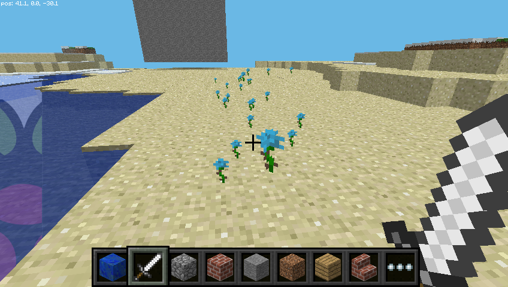
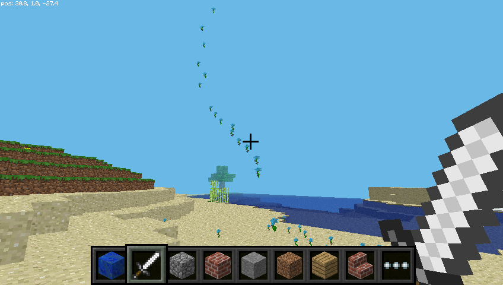
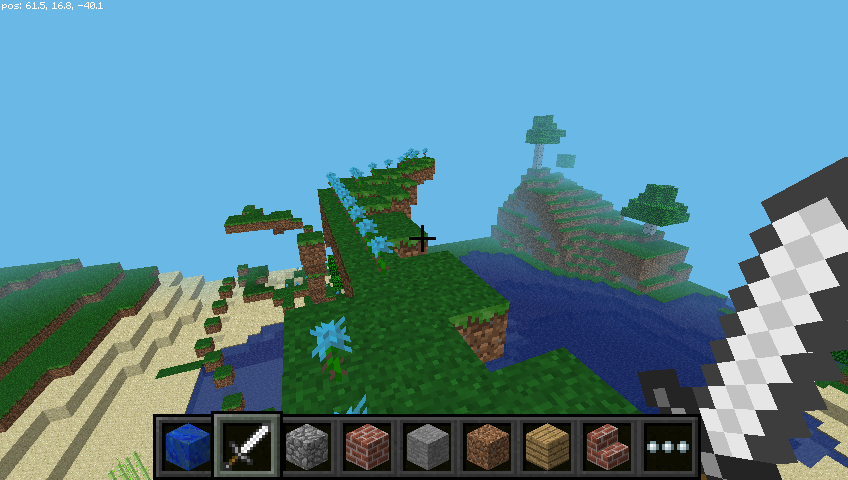

## आपण चालता चालता blocks सोडणे

आता आपल्याला ब्लॉक कसे सोडवायचे हे माहित झाले आहे, आता आपण चालत असताना ब्लॉक ड्रॉप करण्यासाठी आमच्या फिरत्या स्थानाचा वापर करूया.

आपण जिथे जिथे जाल तिथे खालील कोड आपल्या मागे एक फ्लॉवर सोडेल:

```python
from mcpi.minecraft import Minecraft
from time import sleep

mc = Minecraft.create()

flower = 38

while True:
    x, y, z = mc.player.getPos()
    mc.setBlock(x, y, z, flower)
    sleep(0.1)
```

आता थोड्या वेळासाठी पुढे जा आणि आपण मागे सोडलेली फुले पाहण्यासाठी मागे वळा.



कारण आपण `while True` (जेव्हा हे सत्य आहे) हा लूप उपयोग केला होता म्हणून हा नेहमी चालत राहील. हे बंद करण्या साठी Python विंडो मध्ये `Ctrl + C` दाबा.

हवेतून उड्डाण करण्याचा प्रयत्न करा आणि आपण आकाशात सोडलेली फुले पहा:



जेव्हा जेव्हा खेळाडू गवता वर चालतात तेव्हा आम्हाला फक्त फुले टाकायची असतील तर काय करावे? कोणता ब्लॉक कश्या प्रकारचा आहे हे शोधण्यासाठी आपण `getBlock` वापरू शकता:

```python
x, y, z = mc.player.getPos()  # player position (x, y, z)
this_block = mc.getBlock(x, y, z)  # block ID
print(this_block)
```

हे आपल्याला त्या ब्लॉकचे स्थान दाखवतो *ज्यात* आपण उभे आहोत ( हे `0` असेल - एक हवेचा ब्लॉक). आम्ही जाणून घेऊ इच्छित आहोत की आम्ही कोणत्या प्रकारच्या ब्लॉक वर उभे आहोत *on*. यासाठी आम्ही `y` वरून 1 वजा करतोआणि `getBlock()` वापरतो, ज्यामुळे हे निर्धारित होते की आपण कोणत्या प्रकारच्या ब्लॉकवर उभे आहोत:

```python
x, y, z = mc.player.getPos()  # player position (x, y, z)
block_beneath = mc.getBlock(x, y-1, z)  # block ID
print(block_beneath)
```

हे आम्हाला प्लेअर उभा असलेल्या ब्लॉकचा आयडी सांगतात.

आपण सध्या ज्यावर उभे आहात त्याचा ब्लॉक आयडी मुद्रित करण्यासाठी लूप चालवून याची चाचणी करा:

```python
while True:
    x, y, z = mc.player.getPos()
    block_beneath = mc.getBlock(x, y-1, z)
    print(block_beneath)
```


आम्ही फ्लॉवर लावू की नाही हे निवडण्यासाठी आम्ही `if` चिन्ह वापरू शकतो:

```python
grass = 2
flower = 38

while True:
    x, y, z = mc.player.getPos()  # player position (x, y, z)
    block_beneath = mc.getBlock(x, y-1, z)  # block ID

    if block_beneath == grass:
        mc.setBlock(x, y, z, flower)
    sleep(0.1)
```

कदाचित ह्या नंतर आम्ही ज्या टाइल वर उभे आहोत त्याला आम्ही गवता मध्ये बदलू शकतो जर ते आधीच गवत नाही आहे:

```python
if block_beneath == grass:
    mc.setBlock(x, y, z, flower)
else:
    mc.setBlock(x, y-1, z, grass)
```

आता आपण पुढे जाऊ शकतो आणि जर आपण गवता वर चालत असू, तरआपण मागे एक फूल सोडून देऊ. जर पुढील ब्लॉक गवत नसेल, तर ते ते गवतमध्ये बदलते. जेव्हा आपण मागे वळायला लागतो आणि परत चालतो, तेव्हा आपण मागे एक फूल सोडून देतो.

