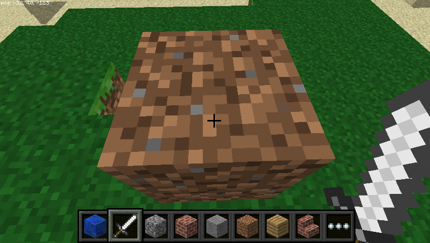
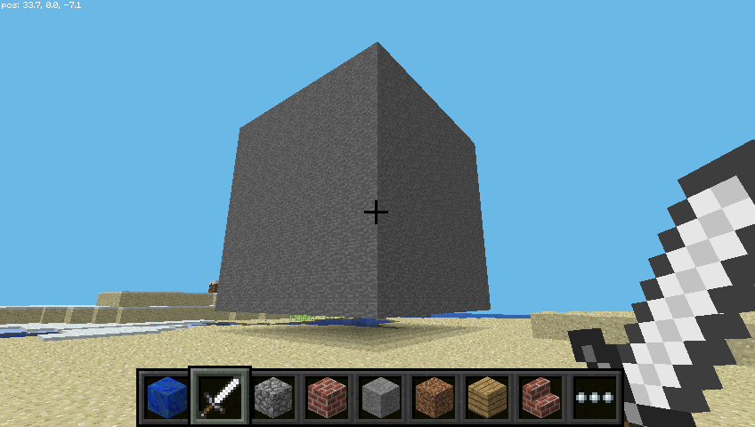

## Gebruik de programmeerinterface van Python

Terwijl Minecraft actief is en de wereld gecreëerd is, haal je je focus weg van het spel door op de `Tab` toets te drukken, waardoor je muis vrijkomt. Open Python 3 vanuit het applicatiemenu en verplaats de vensters zodat ze naast elkaar staan.

Je kunt opdrachten rechtstreeks in het Python-venster typen of een bestand maken zodat je jouw code kunt opslaan en deze een andere keer opnieuw kunt uitvoeren.

Als je een nieuw bestand wilt maken, ga je naar `File > New window` en `File > Save`. Je wilt dit waarschijnlijk in je thuismap of een nieuwe projectmap opslaan.

Begin met het importeren van de Minecraft-bibliotheek, maak een verbinding met de game en test het door het bericht "Hallo wereld" op het scherm te plaatsen:

```python
from mcpi.minecraft import Minecraft 

mc = Minecraft.create() 

mc.postToChat("Hallo wereld")
```

Als je opdrachten rechtstreeks in het Python-venster invoert, druk je op `Enter` na elke regel. Als het een bestand is, sla het op met `Ctrl + S` en voer het uit met `F5`. Wanneer je code wordt uitgevoerd, zou je jouw bericht op het scherm in het spel moeten zien.


### Vind je locatie

Typ het volgende om je locatie te vinden:

```python
pos = mc.player.getPos()
```

`pos` bevat nu je locatie; ga naar elk onderdeel van de coördinaten met `pos.x`, `pos.y` en `pos.z`.

Een andere manier om de coördinaten in afzonderlijke variabelen te krijgen, is door de uitpaktechniek van Python te gebruiken:

```python
x, y, z = mc.player.getPos()
```

Nu bevatten `x`, `y`en `z` elk onderdeel van je positiecoördinaten. `x` en `z` zijn de looprichtingen (vooruit/achteruit en links/rechts) en `y` is omhoog/omlaag.

Merk op dat `getPos()` de locatie van de speler van dat moment geeft, als je van positie verandert, moet je de functie opnieuw oproepen of de opgeslagen locatie gebruiken.

### Teleporteer

Naast het vinden van je huidige locatie, kun je een specifieke locatie opgeven om naar te teleporteren.

```python
x, y, z = mc.player.getPos()
mc.player.setPos(x, y + 100, z)
```

Dit verplaatst je speler 100 plaatsen de lucht in. Dit betekent dat je naar het midden van de lucht teleporteert en meteen terugvalt naar waar je bent begonnen.

Probeer ergens anders naartoe te teleporteren!

### Blok instellen

Je kunt een enkel blok op een gegeven stel coördinaten plaatsen met `mc.setBlock()`:

```python
x, y, z = mc.player.getPos()
mc.setBlock(x+1, y, z, 1)
```

Nu zou een stenen blok naast je moeten verschijnen. Als het niet direct voor je staat, kan het zich naast of achter je bevinden. Keer terug naar het Minecraft-venster en draai met de muis ter plaatse rond totdat je een grijs blok direct voor je ziet.


De argumenten die zijn doorgegeven aan `set block` zijn `x`, `y`, `z` en `id`. De `(x, y, z)` verwijst naar de positie in de wereld (we hebben één blok verwijderd van waar de speler staat gespecificeerd met `x + 1`) en de `id` verwijst naar het type blok dat we willen plaatsen. `1` is steen.

Andere blokken die je kunt proberen:

    Lucht: 0
    Gras: 2
    Grond: 3
    

Probeer het blok nu in iets anders te veranderen:

```python
mc.setBlock(x+1, y, z, 2)
```

Je zou het grijze stenen blok voor je ogen moeten zien veranderen!



#### Blokconstanten

Je kunt ingebouwde blokconstanten gebruiken om je blokken in te stellen, als je hun namen kent. Je hebt echter eerst nog een `import` regel nodig.

```python
from mcpi import block
```

Nu kun je het volgende schrijven om een blok te plaatsen:

```python
mc.setBlock(x+3, y, z, block.STONE.id)
```

Blok-id's zijn vrij eenvoudig te raden, gebruik gewoon ALLE HOOFDLETTERS, maar hier zijn een paar voorbeelden om je te laten wennen aan de naam die ze hebben.

    WOOD_PLANKS
    WATER_STATIONARY
    GOLD_ORE
    GOLD_BLOCK
    DIAMOND_BLOCK
    NETHER_REACTOR_CORE
    

### Blokken als variabele

Als je het id van een blok kent, kan het handig zijn om het als een variabele in te stellen. Je kunt de naam of het getal gebruiken.

```python
dirt = 3
mc.setBlock(x, y, z, dirt)
```

of

```python
dirt = block.DIRT.id
mc.setBlock(x, y, z, dirt)
```

### Speciale blokken

Er zijn enkele blokken met extra eigenschappen, zoals Wol met een extra instelling waarmee je de kleur kunt opgeven. Om dit in te stellen, gebruik je de optionele vierde parameter in `setBlock`:

```python
wool = 35
mc.setBlock(x, y, z, wool, 1)
```

Hier stelt de vierde parameter `1` de wolkleur in op oranje. Zonder de vierde parameter wordt deze ingesteld op de standaardwaarde (`0`) die wit is. Nog wat kleuren zijn:

    2: Magenta
    3: Lichtblauw
    4: Geel
    

Probeer wat meer nummers en zie het blok veranderen!

Andere blokken met extra eigenschappen zijn hout (`17`): eiken, sparren, berken, enz.; hoog gras (`31`): struik, gras, varen; fakkel (`50`): naar het oosten, westen, noorden, zuiden; en meer. Zie de [API-referentie](http://www.stuffaboutcode.com/p/minecraft-api-reference.html) voor alle details.

### Stel meerdere blokken in

Naast het instellen van een enkel blok met `setBlock` kun je een volume in één keer vullen met `setBlocks`:

```python
stone = 1
x, y, z = mc.player.getPos()
mc.setBlocks(x+1, y+1, z+1, x+11, y+11, z+11, stone)
```

Hiermee vul je een 10 x 10 x 10 kubus van massieve steen.



Je kunt grotere volumes maken met de `setBlocks` functie, maar het kan langer duren om het te genereren!