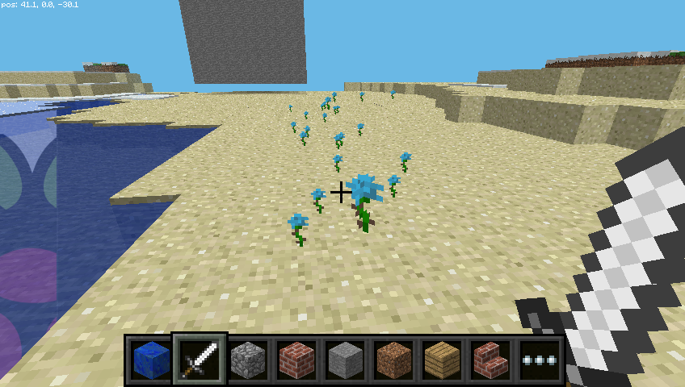
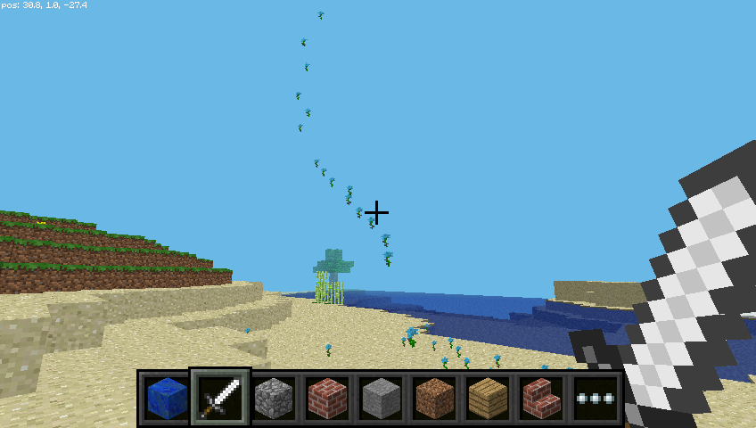
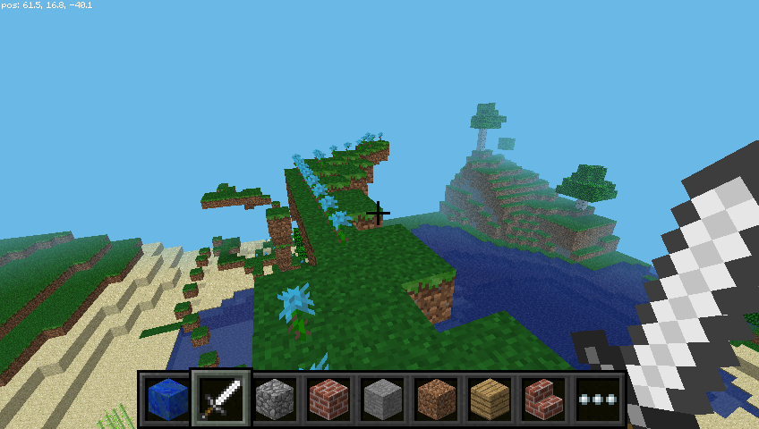

## Blokken laten vallen terwijl je loopt

Nu je weet hoe je blokken moet laten vallen, laten we onze bewegende locatie gebruiken om blokken te laten vallen wanneer je loopt.

De volgende code laat een bloem achter je neer vallen, waar je ook loopt:

```python
from mcpi.minecraft import Minecraft
from time import sleep

mc = Minecraft.create()

flower = 38

while True:
    x, y, z = mc.player.getPos()
    mc.setBlock(x, y, z, flower)
    sleep(0.1)
```

Loop nu een tijdje vooruit en draai je om om de bloemen te zien die je achter je hebt gelaten.



Omdat we een `while True` lus hebben gebruikt, zal dit voor altijd zal doorgaan. Om het te stoppen, druk je op `Ctrl + C` in het Python-venster.

Probeer door de lucht te vliegen en zie de bloemen die je in de lucht achterlaat:



Wat als we alleen bloemen willen laten vallen als de speler op gras loopt? We kunnen `getBlock` gebruiken om erachter te komen welk type een blok is:

```python
x, y, z = mc.player.getPos() # spelerpositie (x, y, z)
this_block = mc.getBlock(x, y, z) # blok ID
print(this_block)
```

Dit vertelt je de locatie van het blok waar je *in* staat (dit zal `0` - een luchtblok zijn). We willen weten *op* welk type blok we staan. Hiervoor trekken we 1 af van de waarde `y` en gebruiken we `getBlock()` om te bepalen op welk type blok we staan:

```python
x, y, z = mc.player.getPos() # spelerpositie (x, y, z)
block_beneath = mc.getBlock(x, y-1, z) # blok ID
print(block_beneath)
```

Dit vertelt ons het id van het blok waarop de speler staat.

Test dit door een lus uit te voeren om het blok-id te tonen van waar je nu op staat:

```python
while True:
    x, y, z = mc.player.getPos()
    block_beneath = mc.getBlock(x, y-1, z)
    print(block_beneath)
```


We kunnen een `if` instructie gebruiken om te kiezen of we een bloem planten of niet:

```python
grass = 2
flower = 38

while True:
    x, y, z = mc.player.getPos()  # spelerpositie (x, y, z)
    block_beneath = mc.getBlock(x, y-1, z)  # blok ID

    if block_beneath == grass:
        mc.setBlock(x, y, z, flower)
    sleep(0.1)
```

Misschien kunnen we vervolgens de tegel waarop we staan in gras veranderen als het nog geen gras is:

```python
if block_beneath == grass:
    mc.setBlock(x, y, z, flower)
else:
    mc.setBlock(x, y-1, z, grass)
```

Nu kunnen we vooruit lopen en als we op gras lopen, laten we een bloem achter. Als het volgende blok geen gras is, wordt het gras. Als we ons omdraaien en teruglopen, laten we nu een bloem achter ons.

